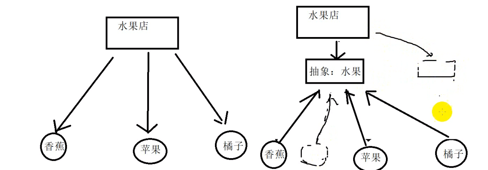
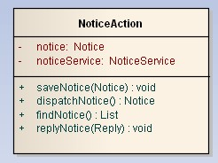
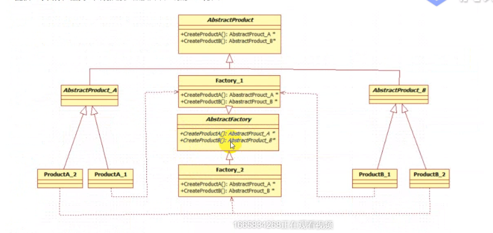
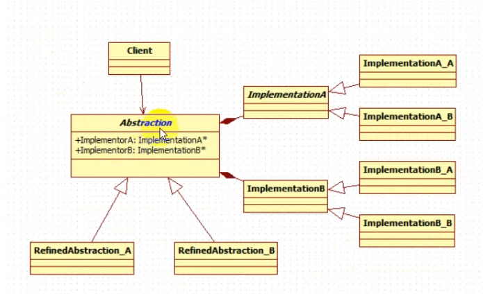

#  一、设计模式的定义

设计模式**是在特定环境下人们解决某类重复出现的一套成功或有效的解决方案。**

设计模式最终的目的为了应对变化，提高代码的复用和重用性, 应付

1. 客户需求的变化

2. 技术平台变化

3. 开发团队的变化

4. 市场环境的变化

# 二、设计模式的分类

总体来说设计模式分为三大类

+ 创建型模式(5种)：工厂方法模式、抽象工厂模式、单例模式、建造者模式、原型模式。

+ 结构型模式(7种)：适配器模式、装饰器模式、代理模式、外观模式、桥接模式、组合模式、享元模式。

+ 行为型模式(11种)：策略模式、模板方法模式、观察者模式、迭代子模式、责任链模式、命令模式、备忘录模式、状态模式、访问者模式、中介者模式、解释器模式。

+ 其实还有两类：并发型模式和线程池模式。

# 三、设计模式的原则

总原则：开闭原则（Open Close Principle）

开闭原则就是说对扩展开放，对修改关闭。在程序需要进行拓展的时候，不能去修改原有的代码，而是要扩展原有代码，实现一个热插拔的效果。所以一句话概括就是：为了使程序的扩展性好，易于维护和升级。想要达到这样的效果，我们需要使用接口和抽象类等，后面的具体设计中我们会提到这点。

**1、单一职责原则**

不要存在多于一个导致类变更的原因，也就是说每个类应该实现单一的职责，如若不然，就应该把类拆分。

+ 一个类应该仅有一个引起它变化的原因

+ 变化的方向隐含类的责任

**2、开放封闭原则**

+ 对扩展开放,对更改封闭
+ 类模块可扩展，但不可修改


**3、里氏替换原则（Liskov Substitution Principle）**

里氏代换原则(Liskov Substitution Principle LSP)面向对象设计的基本原则之一。 里氏代换原则中说，任何基类可以出现的地方，子类一定可以出现。 LSP是继承复用的基石，只有当衍生类可以替换掉基类，软件单位的功能不受到影响时，基类才能真正被复用，而衍生类也能够在基类的基础上增加新的行为。里氏代换原则是对“开-闭”原则的补充。实现“开-闭”原则的关键步骤就是抽象化。而基类与子类的继承关系就是抽象化的具体实现，所以里氏代换原则是对实现抽象化的具体步骤的规范。

历史替换原则中，子类对父类的方法尽量不要重写和重载。因为父类代表了定义好的结构，通过这个规范的接口与外界交互，子类不应该随便破坏它。

**4、依赖倒转原则（Dependence Inversion Principle）**

+ 高层(稳定)不依赖低层(变化),两者依赖抽象(稳定)
+ 抽象(稳定)不依赖细节(变化),细节依赖抽象(稳定)。



**5、接口隔离原则（Interface Segregation Principle）**

这个原则的意思是：每个接口中不存在子类用不到却必须实现的方法，如果不然，就要将接口拆分。使用多个隔离的接口，比使用单个接口（多个接口方法集合到一个的接口）要好。

+ 内部接口尽量私有化 

**6、迪米特法则（最少知道原则）（Demeter Principle）**

就是说：一个类对自己依赖的类知道的越少越好。也就是说无论被依赖的类多么复杂，都应该将逻辑封装在方法的内部，通过public方法提供给外部。这样当被依赖的类变化时，才能最小的影响该类。

最少知道原则的另一个表达方式是：只与直接的朋友通信。类之间只要有耦合关系，就叫朋友关系。耦合分为依赖、关联、聚合、组合等。我们称出现为成员变量、方法参数、方法返回值中的类为直接朋友。局部变量、临时变量则不是直接的朋友。我们要求陌生的类不要作为局部变量出现在类中。

+ 对象应当对其他对象尽可能少的了解
+ 各个模块之间相互调用时,通常会提供一个统一的接口来实现


**7、合成复用原则（Composite Reuse Principle）**

原则是尽量首先使用合成/聚合的方式，而不是使用继承。

+ 类的继承通常是"白箱复用",对象组合通常是"黑箱复用”
+ 继承在一定程序破坏封装性,子类和父类耦合度高

# 四、c++类图

## 基本概念：

**类图（Class Diagram）**: ==类图==是面向对象系统建模中最常用和最重要的图，是定义其它图的基础。类图主要是用来显示系统中的类、接口以及它们之间的静态结构和关系的一种静态模型。

类图的3个基本组件：**类名、属性、方法**。

​                                                         

## 常见的有以下几种关系

 **泛化（Generalization）**, **实现（Realization）**，**关联（Association)**，**聚合（Aggregation**，**组合(Composition)**，**依赖(Dependency)**

### 1.**泛化（Generalization)**

**【泛化关系】**：**是一种继承关系，**表示一般与特殊的关系，它指定了子类如何特化父类的所有特征和行为。例如：老虎是动物的一种，即有老虎的特性也有动物的共性。
**【箭头指向】**：==带三角箭头的实线，箭头指向父类==
                                                                

### 2. **实现（Realization）**

**【实现关系】**：**是一种类与接口的关系**，表示类是接口所有特征和行为的实现.
**【箭头指向】**：==带三角箭头的虚线，箭头指向接口==
                                                                

### 3. 关联（Association)

**【关联关系】**：**是一种拥有的关系，它使一个类知道另一个类的属性和方法**；如：老师与学生，丈夫与妻子关联可以是双向的，也可以是单向的。双向的关联可以有两个箭头或者没有箭头，单向的关联有一个箭头。
**【代码体现】**：成员变量
**【箭头及指向】**：==带普通箭头的实心线，指向被拥有者==

上图中，老师与学生是双向关联，老师有多名学生，学生也可能有多名老师。但学生与某课程间的关系为单向关联，一名学生可能要上多门课程，课程是个抽象的东西他不拥有学生。

**下图为自身关联：**
                       

### 4. 聚合（Aggregation）

**【聚合关系】**：是整体与部分的关系，且部分可以离开整体而单独存在。如车和轮胎是整体和部分的关系，轮胎离开车仍然可以存在。

聚合关系是关联关系的一种，是强的关联关系；关联和聚合在语法上无法区分，必须考察具体的逻辑关系。

**【代码体现】**：成员变量
**【箭头及指向】**：==带空心菱形的实心线，菱形指向整体==


### 5. 组合  (Composition)

**【组合关系】**：是整体与部分的关系，但部分不能离开整体而单独存在。如公司和部门是整体和部分的关系，没有公司就不存在部门。

组合关系是关联关系的一种，是比聚合关系还要强的关系，它要求普通的聚合关系中代表整体的对象负责代表部分的对象的生命周期。

**【代码体现】**：成员变量

**【箭头及指向】**：==带实心菱形的实线，菱形指向整体==
                                                     

### 6. 依赖  (Dependency)

**【依赖关系】**：是一种使用的关系，即一个类的实现需要另一个类的协助，所以要尽量不使用双向的互相依赖.
**【代码表现】**：局部变量、方法的参数或者对静态方法的调用
**【箭头及指向】**：==带箭头的虚线，指向被使用者==
                                                          
各种关系的强弱顺序：

**泛化 = 实现 > 组合 > 聚合 > 关联 > 依赖**

下面这张UML图，比较形象地展示了各种类图关系：

**多重性(Multiplicity) :** 通常在**关联、聚合、组合**中使用。就是代表有多少个关联对象存在。使用数字…星号（数字)表示。如下图，一个割接通知可以关联0个到N个故障单。


# 五、类

## 构造函数和析构函数

### 构造函数

+ **注意如果声明,  就必须写完定义再运行程序不然会报错**
+ **用explicit 修饰构造函数得话, 不能采用  类名 对象 = { } 的方式构造对象**
+ **成员初始化列表 和 this指针  可以在定义的形参名和数据成员相同时候避免二义性**


```c++
class MM
{
public:
	//MM() = delete;     //删除默认的函数
	//MM() = default;  //表示当前使用的函数是默认函数, 不用再写声明了   iterator() = default;
	MM()
	{
		cout <<"自己写了构造函数，默认的构造函数不存在了" << endl;
	}
};

//------------------
class Boy
public:
	Boy(string name, int age， int num): name(name), age(age) , num( num) {} // 成员参数列表
};
```

### 析构函数

+ **当对象的属性中有指针并且申请了内存,  就必须手写一个出来**


##  友元函数

+ 写类里的

+ **常用的友元:  重载 << 运算符**

+ 返回引用,参数也都是引用,   输出时类的形参加了const

  ```c++
  固定格式:
  #include <iostream>
  
  friend std::istream &operator>>(std::istream &is, complex &c);  //不用const的原因:输入肯定是想{  
     //要修改类对象的数据
   	is >> c.sdf;
  	return is;
  }
  
  -----------
  friend std::ostream &operator<<(std::ostream &os, const complex &c); // 输出只是读取,所以要加上const
  ```

+ **一般情况看调用的类在操作的运算符那侧来选择使用非成员还是成员函数来进行重载. 成员函数的运算符重载类一定在左侧**

+ **末尾没有 const**

+ **友元函数的运算符重载的形参是要操作的全部东西**

**c++ 函数前面和后面 使用const 的作用：**

- 前面使用const 表示返回值为const
- 后面加 const表示函数不可以修改class的成员

##  类的重载运算符函数

+ **类的运算符重载的形参有一个操作数是通过this指针隐式的传递的**

+ **重要思想:**  如果方法通过计算得到的是一个新的类, 则应考虑是否可以使用类的构造函数来完成(这样可以通过构造函数去创建一个无名的对象返回给调用者,可以让代码简洁)

+ 确定const是否要加上.  **const一般情况是都要加上的**

+ **重载+ - *  一般返回值都是类(按值转递).   比较符(>,>==,<=)的话一般返回值就是bool** (通过默认运算符的或者调用函数完成需求).     **重载[], ++ 一般返回引用,不然会出现如下问题**

  ```c++
  T& operator[](int index)   //arr[0] = 1;  // 出现表达式是可修改的左值 解决方法: 重载[]时返回引用 
  iterator& operator++(int)   //++
  ```

  

  ## 复制构造函数和赋值运算符重载

  ```c++
  int main
  (
  	MM mm = { "小可爱"};
      MM girl = mm;   //调用拷贝构造
  	mm. print();
  	MM gg;
  	gg = mm;       //没有调用拷贝构造
  	gg.print();
  	return 0;
  }
  ```

  

  **复制构造函数**(深度去复制一个对象给另一个对象)

  记忆:肯定也是构成函数的一种.==参数都加了const==

  **会调用拷贝构造函数的情况 :**

  1. **一个对象初始化另一个对象时.**
  2. **当函数按值传递的类对象时  或者  函数返回对象时, 都会使用到复制构造函数(没有自定义编译器会自动生成复制构造).**

  **注意:**

  + 复制构造函数会调用析构函数

  + **尽量按引用传递对象**,可以节约调用构造函数的时间和内存

  + 一般情况下要与赋值运算符(=)重载连用

    

    ```c++
    StringBad::StringBad(const StringBad &st)    // 复制构造函数  // 没必要判断原来有没有因为只能在创建对象时用复制构造函数
    {
    
    	num strings++;  // 静态成员
        
    	len = st.len;
    	str = new char [len + 1]
    	std::strcpy(str, st.str);
    }
    
    // 如果的数组必须用循环
    ```

    

  **赋值运算符重载**

  + 由于目标对象可能引用了以前分配的数据，所以要delete.

  + 函数应当避免将对象赋给自身.

  + **函数返回一个指向调用对象的引用.**

  + ```c++
    StringBad & StringBad::operator=(const StringBad & st)
    {
        // 复制来源就是本身数据时
        if (this == &st)    // object assigned to itself
    		return *this;   // alldone
        
        //
    	delete [] str  //  原来的数据是动态创建的,所以要把自己原来的内容释放
            			// str是开辟内存空间的变量而不是类型名称
            		   //  因为这里在创建类的时候都会调用构造函数,又每一个构造函数都开创了空间
            
       // 做的事情就是复制构造函数做的事情
    	len = st.len;
    	str = char[len+1] 
    	std::strcpy(str, st.str); 
    	return *this； // 返回调用对象
    }
    
    // 返回类型不是const,因为方法operator=() 返回一个指向s2的引用,可以对其进行修改;
    ```

  ### 解决深浅拷贝问题

  **深拷贝和浅拷贝**

  1. 默认的拷贝构造是浅拷贝，不做内存申请的拷贝一般也是浅拷贝
  2. 深拷贝，必须要为数据做新的内存申请，不可能让多个对象的指针属性指向同一段内存

  ```c++
  #include <iostream>
  #include <cstring>
  #pragma warning(disable:4996)
  
  using namespace std;
  
  
  class Person
  {
  public:
  	Person();
  	Person(const char* name, int age);
  	Person(const Person& p);
  	~Person();
  	Person& operator=(const Person& pr);
  	void show()
  	{
  		cout << "show" << endl;
  		cout << this->m_Name << this->m_Age;
  	}
  
  private:
  	char* m_Name;
  	int m_Age;              // 指针
  };
  
  
  
  Person::Person()
  {
  	m_Name = new char[10];
  	strcpy(m_Name, "null");
  	this->m_Age = 100;
  }
  
  Person::Person(const char* name, int age)
  {
  	if (name)
  	{
  		m_Name = NULL;
  		int len = strlen(name);
  		m_Name = new char[len + 1];
  		strcpy(m_Name, name);
  	}
  	else
  	{
  		strcpy(m_Name, "null");
  	}
  	m_Age = age;
  }
  
  Person::Person(const Person& p)
  {
  	int len = strlen(p.m_Name);
  	m_Name = new char[len + 1];
  	strcpy(m_Name, p.m_Name);
  
  	m_Age = p.m_Age;
  }
  
  Person::~Person()
  {
  	delete[] m_Name;
  }
  
  Person& Person::operator=(const Person& pr)
  {
  	if (this == &pr)
  		return *this;
  
  	delete[] this->m_Name;
  
  	int len = strlen(pr.m_Name);
  	m_Name = new char[len + 1];
  	strcpy(m_Name, pr.m_Name);
  
  	m_Age = pr.m_Age;
  
  	return *this;
  }
  
  int main(void)
  {
  	Person pe("44", 11);
  	Person p("11", 44);
  	p.show();
  	p = pe;
  	p.show();
  
  	Person p2(p);
  	p2.show();
  
  	Person p3;
  	p3.show();
  	return 0;
  }
  ```

  

## **类中的public、protected、private **

1、[public]() 类内外均可访问。

2、[protected](https://so.csdn.net/so/search?q=protected&spm=1001.2101.3001.7020)：类内部、派生类内部--->可以访问；  类的对象、派生类的对象-->不可访问。

3、[private](https://so.csdn.net/so/search?q=private&spm=1001.2101.3001.7020)：只有本类内部-->>可以访问；                   类的对象、派生类、派生类的对象，统统的-->不可访问。

**proteced和private 在外部都不能访问,    唯一区别在有派生类中展现**

```c++
class Father
{
public:
	Father(){};
		void print()
	{
		cout << "dsd";
	}
private:
	int money;
protected:
	int name;
};

int main()
{
	Father father;
	father.print();  // public    // 正确
	father.name;     // protect   // 错误
	father.money;    // private   // 错误
	return 0;
}
```


## 三种继承方式

**类私有成员-----只有对应的类的成员函数能访问**

私有继承：`使用私有继承，基类的公有成员和保护成员都将成为 派生类的私有成员，是可以可以在派生类的成员函数中使用`

保护继承:  `与私有继承的区别是在派生类中才会表示出来.在派生类中可以直接访问基类的保护成员.对于外部世界而言保护成员行为和私有成员一致`

公有继承:  **可以在派生类中添加新的类数据或类方法，**。**

==父类中的私有属性, 无论什么继承方式 , 子类都无法访问==

多态公有继承: **如果在派生类中修改了基类类方法的行为。**

派生类 不能从继承继承 :  友元函数  构造析构函数(原因类名不同) 赋值构造函数

总结:   父类中的私有属性, 无论什么继承方式 , 子类都无法访问 , 其他的由继承方式确定(能降级或者平级, 比如: public继承就是该是啥就是啥继承完事儿)

```c++
#include <iostream>
using namespace std;

/*
	No.1继承中的基本概念:
	父类  子类
	基类派生类(子类中有新增东西)
	如何写一个继承
	class  子类 : 继承方式  父类名
	{

	};
	继承方式:  public  protected  private

	No.2继承的实质:  表示父类中的属性在子类当中都存在
	NO.3 继承的权限问题
	继承方式:   public     protected private
	父类属性:   
	pubic:      pubic       protected   private
	protected:    protected   protected   private
	private:    不可访问     不可访问      不可访问
	权限限定词只会增强权限

	// 父类中的私有属性, 无论什么继承方式 , 子类都无法访问
*/

class father
{
public:
	father(int money) : money(money)
	{}
	void print();
private:
	int money;
protected:
	int name;
};


// 公有属性  -- > 同属性继承
class Son : public father
{
public:
		//print();
private:
	
protected:
	    //int name;
};

// 私有继承 ---> 基类的公有成员和保护成员都将成为 派生类的私有成员 , 因此可以在派生类的成员函数中使用
class Son2 : private father
{
public:
	
protected:

private:
	//  print();
	//   int name;

};

//保护继承 ---> 在派生类中可以直接访问基类的保护成员.对于外部世界而言保护成员行为和私有成员一致
class Son3 : protected father
{
public:

protected:
	//  print();
	//  int name;
private:

};


int main()
{	
	return 0;
}

```


## 有关派生类构造函数的要点

说白了通过初始化参数列表, 利用父类的构造构造函数,构造个父类

继承中构造函数的写法

1. 子类的构造函数必须要调用父类的构造函数，因为 继承下来的属性，只能通过父类的构造函数进行初始化

2. 子类的构造函数初始化父类的属性的时候，必须采用初始化参数列表的方式进行初始化

重点:

1. 创建基类对象(在头文件中操作)

   + 法一:    **B(int n, const A &a)**
   + 法二:    **B(int n,  int a, string str);**  // int a, string str 是  A的数据成员

2. 派生类构造函数应通过成员初始化列表将基类信息传递给基类构造函数(一般在源文件中)(1.基类的参数写在后面,  2. 形参名和基类的一致. )

   + 法一:   

     ```c++
     B::B(int n, const A &a) : A(a)   // 类传递类,会调用复制构造函数.//但不需要使用动态内存所以可以这样
     {
     
     }
     ```

   + 法二:   

     ```c++
     B::B(int n,  int a, string str) : A(a, str)  // int a, string str 是A的数据成员
     {
     
     }
     ```

3. 派生类构造函数初始化派生类新增的数成员

   

+ **太长换行格式:** 
  + **(1) .h中与()对齐**
  + **(2).cpp文件中与最前面对齐**
  + **(3) :  在行首是可以的**


## 派生类与基类的关系

1. **派生类对象可以使用基类的方式(私有方法除外).通过 . 的方式**

   + 如:

     ```c++
     B b;
     b.a1();  //a1是基类的方法 
     ```

     

2. **基类指针/引用可以在不进行显示类型转换的情况下指向派生类(单向的),  但是基类的指针只能调用基类的方法.不能直接去调用派生类的方法.**(==除虚方法, 虚方法可以自动匹配,指针指向的对象==)

   + 如:

     ```c++
     A *a = &B;
     a->a1(); // 基类的指针只能调用基类的方法  // 如果是虚函数就会使用的是子类的
     ```

      例子:

     ```c++
     #include <iostream>
     
     using namespace std;
     
     class MM
     {
     public:
     	virtual void printf()
     	{
     		cout << "父类的虚函数" << endl;
     	}
     
     	void print()
     	{
     		cout << "父类的普通函数" << endl;
     	}
     };
     
     class Boy : public MM
     {
     public:
     	void printf()
     	{
     		cout << "子类的虚函数" << endl;
     	}
     
     	void print()
     	{
     		cout << "子类的普通函数" << endl;
     	}
     };
     
     int main(void)
     {
     	MM* mm = new Boy;
     	mm->print();        // 父类的普通函数
     	mm->printf();	    // 子类的虚函数
     
     	return 0;
     }
     ```

     

3. **能将基类的对象初始化为子类对象**

   + 如:

     ```c++
     B b(xxx);
     A a(b);
     
     -------------
     B b(xxx);
     A a;
     a = b; // 赋值-->调用重载运算符
     ```

     

## 多态公有继承

多态公有继承: ==**如果在派生类中修改了基类类方法的行为就使用多态公有继承。**==

1. **基类必须使用一个虚析构函数(virtual ~B())**

2. **如果要派生类中重新定义基类的方法, 则将它设置为虚方法(及方法声明的前面加一个virtual. 基类和派生类的方法样子一样) ,否则设置为非虚函数**

3. **虚方法定义时,如果派生类的 虚方法要使用基类的虚函数则要加 :: 指明是基类的虚函数(原因同名).  但是使用基类普通方法就直接用就是**.  用虚函数则使用动态联编

4. 可以使用一个基类的对象指针.来表示多种类型的

5. 纯虚函数:   声明纯虚函数的时候标记=0

   1，当想在基类中抽象出一个方法，没有实现，且该基类只做能被继承，而不能被实例化  ；

   2，这个方法必须在派生类(derived class)中被实现；

   ```c++
   class CShape
   {
   public:
       virtual void Show() =0;
   };
   ```

    

**多态**

```c++
#include <iostream>

using namespace std;

class MM
{
public:
	void print()
	{
		cout << "MM print" << endl;
	}

	virtual void printVirtual()
	{
		cout << "MM printVirtual" << endl;
	}

	virtual ~MM();
protected:

};


class Boy : public MM
{
public:
	void print()
	{
		cout << "Boy print" << endl;
	}

	void printVirtual()    // 重写
	{
		cout << "Boy printVirtual" << endl;
	}
	~Boy();
protected:
};

class Nn : public Boy
{
public:
	void printVirtual()
	{
		cout << "Nn printVirtual" << endl;
	}
	~Nn();
};


int main(void)
{
	// N0.2 多态
	// 正常情况下的对象 : 就近原则同名无所谓
	MM mm;
	Boy boy;
	mm.print();
	boy.print();
	// 子类如果想要访问继承下来的同名函数, 使用 类名::强制指定
	boy.MM::print();

	//非正常情况:  父类指针被子类对象初始化，但是子类对象不能被父类对象初始化
	//不存在virtual的情况下:看指针类型
	MM* pMM = new Boy;
	pMM->print();
	// Boy * pBE = new MM;  // 危险行为

	// 存在virtual的情况下:
	pMM->printVirtual();  // 用的子类同名函数

	pMM = &mm;
	pMM->printVirtual();  // 用父类中的函数

	//C++多态，因为赋值的不同，而导致的相同行为的不同的结果，把这一现象称之为多态(重写)

	// 多态的必要因素:
	// 1.必须父类存在virtual 2.子类必须存在同名函数  3.必须存在这样非正常情况下的指针使用(父类指针被子类指针初始化)
	// 虚函数一直是虚函数,不论被继承多少次
	pMM = &boy;
	pMM->printVirtual();
	Boy* pBg = new Nn;
	pBg->printVirtual();  // 用的子类Nn的同名函数


	// N0.3 析构问题
	// 虚析构函数

	return 0;
}
```


**纯虚函数和抽象类**

```c++
#include <iostream>

using namespace std;

//No.1纯虚函数就是没有函数体的虚函数虚函数=0;
//No.2具有至少—个纯虚函数的类叫做抽象类
// 2.1抽象不能构建对象
// 2.2抽象类可以构建对象指针

//No.3 ADT abstract data type : 抽象数据类型
//抽象类被继承下来，子类如果想要构建对象，必须要把父类中纯虚函数重写

class MM
{
public:
	virtual void print() = 0;
};


class stack
{
public:
	virtual ~stack();
	virtual void push() = 0;
	virtual void pop() = 0;
	virtual bool empty()const = 0;
	virtual bool full() = 0;
	virtual int tpo() = 0;
	virtual int size() = 0;
};

class arrrStack : public stack
{
public:
	~arrrStack();
	void push()
	{}
	void pop()
	{}
	bool empty() const
	{
		return true;
	}
	bool full()
	{
		return false;
	}
	int tpo()
	{
		return 11;
	}
	int size()
	{
		return 111;
	}
};

int main(void)
{
	//MM mm;  // err 抽象不能创建对象

	stack* pStack = new arrrStack;
	for (int i = 0; i < 3; i++)
	{

		pStack->push();
	}
	return 0;
}
```


## 虚函数

//No.1 虚函数在类中用virtual修饰的函数就是虚函数

No.2虚函数对于类的内存影响

+ 2.1空的类的内存:    1字节(类中不存在虚函数)

+ 2.2对于类有数据后，就按照c语言结构一样的内存对齐方式去计算内存

+ 2.3 虚函数对于类的内存影响

+ 虚函数对于类的内存影响无论多少个虚函数都是用一个指针去存储，所以只会增加一个指针类型的字节数(4)

  ```c++
  #include <iostream>
  #include <string>
  
  using namespace std;
  
  class MM
  {
  public:
  	virtual void print()
  	{
  		cout << "one" << endl;
  	}
  	virtual void print01()
  	{
  		cout << "two" << endl;
  	}
  protected:
  
  };
  
  class Boy
  {
  
  };
  
  
  int main(void)
  {
  	// 空的类占一个字节
  	cout << sizeof(Boy);
  
  	// 虚函数存放的函数指针
  	cout << sizeof(MM);      // 是8
  
  	// 通过虚函数 去访问函数  
  	MM mm;
  	int** pObeject = (int**)&mm;
  	using pf = void(*)();
  
  	pf pf1 = (pf)pObeject[0][0];   // 调用第一个虚函数
  	pf1();
  
  	pf pf2 = (pf)pObeject[0][1];
  	pf2();
  	return 0;
  }
  ```

  

  虚函数的保存方式:

  


# C++匿名对象

**1.产生匿名对象的三种情况：**
  1）以值的方式给函数传参；

​				Cat(); —> 生成了一个匿名对象，执行完Cat( )代码后，此匿名对象就此消失。这就是匿名对象的生命周期。

​			   Cat cc = Cat(); —>首先生成了一个匿名对象，然后将此匿名对象变为了cc对象，其生命周期就变成了cc对象的生命周期。

  2）[类型转换]

  3）函数需要返回一个对象时；return temp;

**2.匿名对象的生命周期**

注意：匿名对象的生命周期（重要）

例子1：

```cpp
class A
{
public:
    A(int s)
    {
        i = s;
    }

    void myshow()
    {
          cout<<i<<endl;
    }
private:
     int i;
};

void playstage()
{
     cout << A(10).myshow() << endl;//调用匿名对象

　　　A a = 11;//此处发生隐身转换。。。。相当于  A a = A(11);   此处的A(11)就是一个匿名对象

     A b = A(12);//当匿名对象有等待初始化的对象接的时候，只调用一次构造和析构函数
     
     A c;//调用一次构造函数
     c = A(13);//此处为赋值。此处的匿名对象会调用一次构造函数
}

void main()
{
    playstage();

    system("pause");

}

```

例2：

```cpp
class Cat
{
public:
    Cat()
    {
        cout<<"Cat类 无参构造函数"<<endl;
    }

    Cat(Cat& obj)
    {
        cout<<"Cat类 拷贝构造函数"<<endl;
    }

    ~Cat()
    {
        cout<<"Cat类 析构函数 "<<endl;
    }

};

void playStage() //展示对象的生命周期
{
    Cat();             /*在执行此代码时，利用无参构造函数生成了一个匿名Cat类对象；执行完此行代码，
                            因为外部没有接此匿名对象的变量，此匿名又被析构了*/
    Cat cc = Cat();    /*在执行此代码时，利用无参构造函数生成了一个匿名Cat类对象；然后将此匿名变 成了cc这个实例对象*/
    
}

int main()
{
    playStage();
    system("pause");
    return 0;
}
```

输出：
1.Cat类 无参构造函数
2.Cat类 析构函数
3.Cat类 无参构造函数
4.Cat类 析构函数

说明：

1、在执行playStage( )函数中的Cat( )时，生成了一个匿名对象，执行完Cat( )代码后，此匿名对象就此消失。这就是匿名对象的[生命周期](https://so.csdn.net/so/search?q=生命周期&spm=1001.2101.3001.7020)。

2、在执行playStage( )函数中Cat cc = Cat();时，首先生成了一个匿名对象，因为外部有cc对象在等待被实例化，然后将此匿名对象变为了cc对象，其生命周期就变成了cc对象的生命周期。

**总结：**
如果生成的匿名对象在外部有对象等待被其实例化，此匿名对象的生命周期就变成了外部对象的生命周期；如果生成的匿名对象在外面没有对象等待被其实例化，此匿名对象将会生成之后，立马被析构。

**3.匿名对象产生的三种场景**

```cpp
//匿名对象产生的三种场景
#include<iostream>
using namespace std;

class Point{
public:
    Point(int a,int b){
        cout << "有参构造函数被调用了1" << endl;
        this->x = a;
        this->y = b;
    }
    Point(Point &a1){
        cout << "拷贝构造函数被调用了2" << endl;
        this->x = a1.x;
        this->y = a1.y;
    }
    ~Point(){
        cout << "析构函数被调用了3" << endl;
        cout << "x=" << x << endl;
        cout << "y=" << y << endl;
    }
    Point Protset(int a){
        this->x = a;
        return *this;
        //执行 return *this; 会产生一个匿名对象，作为返回值
        //强调：如果返回值是引用，则不会产生匿名对象
    }

    Point Protset2(int a){
        Point temp(a, a);
        return temp;
        //执行 return temp;会先产生一个匿名对象,执行拷贝构造函数，作为返回值,
        //然后释放临时对象temp
    }

    //总结：函数返回值为一个对象（非引用）的时候会产生一个匿名对象，匿名对象根据主函数的操作决定生命周期

    Point& Protset3(int a){
        Point temp(a, a);
        return temp;
        //执行 return temp;不会产生匿名对象，而是会将temp的地址先赋值到引用中，
        //在释放temp的内存，此时Point&得到是一个脏数据
    }

    void PrintfA()const{
        cout << "x="<<x << endl;
        cout << "y=" << y << endl;
    }

private:
    int x;
    int y;
};


void ProtectA(){
    //生成一个匿名对象，因为用来初始化另一个同类型的对象，这个匿名对象会直接转换成新的对象，
    //减少资源消耗
    Point p1 = Point(1,1);
    /*Point p2(2, 2);
    p2 = p1.Protset(3);
    p2.PrintfA();*/
    //观察发现p2打印出正确数据,因此得出结论p1.Protset(3);返回来一个匿名对象，
    //但是这个匿名对象执行完"="之后，才会被释放
    Point p4(5, 5);
    p4=p1.Protset2(4);
    p4.PrintfA();
}

void main(){
    ProtectA();
    system("pause");
}
```


注意:

+ **静态数据成员(属性和方法)是在必须在包含类方法的.cpp文件进行初始化 而不是类定义头文件里**

+ **类中设置const常量,必须使用static并且进行初始化.**
+ **类中如果要使用const也可以使用成员初始化列表 **


# 六、设计模式

## 1.  单例模式

### 单例模式概念

==保证整个系统中一个类只有一个对象的实例，实现这种功能的方式就叫单例模式==

在应用系统开发中，我们常常有以下需求:

1. 需要生成唯一序列的环境方便控制.   就像日志管理，如果多个人同时来写日志，你一笔我一笔那整个日志文件都乱七八糟，如果想要控制日志的正确性，那么必须要对关键的代码进行上锁，只能一个一个按照顺序来写，而单例模式只有一个人来向日志里写入信息方便控制，避免了这种多人干扰的问题出现。
2. 需要频繁实例化然后销毁的对象。
3. 创建对象时耗时过多或者耗资源过多，但又经常用到的对象。
4. 方便资源相互通信的环境.  比如：大家都要喝水，但是没必要每人家里都打一口井是吧，通常的做法是整个村里打一个井就够了，大家都从这个井里面打水喝。

实际案例:

+ 多线程中网络资源初始化·回收站机制
+ 任务管理器
+ 应用程序日志管理
+ 打印机、数据库连接池、应用配置。

### 单例模式实现代码

UML图：


**懒汉式**(==不创建对象的方式==)

```c++
#include <iostream>

using namespace std;

class SingleTon
{
public:
	static SingleTon* m_singleton;   // 1. 提供静态指针
	static SingleTon* GetInsance()   // 2. 提供静态方法
	{
		if (m_singleton == NULL)
		{
			m_singleton = new SingleTon;
		}
		return m_singleton;
	}

	void testPrint()
	{
		cout << "测试 调用...\n";
	}

private:
	SingleTon()                    // 3. 构造函数私有化
	{
		cout << "构造对象...." << endl;
		m_singleton = NULL;
	}

};


SingleTon* SingleTon::m_singleton = NULL;  // 4.静态指针=null

int main(void)
{
	SingleTon* p1 = SingleTon::GetInsance();  // 构造函数私有化内外不能创建对象所以只能这样
	SingleTon* p2 = SingleTon::GetInsance();
	cout << "p1" << hex << p1 << endl;
	cout << "p2" << hex << p2 << endl;
	p1->testPrint();
	p2->testPrint();
	return 0;
}
```


**饿汉式(存在资源竞争的问题)**

```c++
#include <iostream>

using namespace std;

class SingleTon
{
public:
	static SingleTon* m_singleton;   // 提供情态指针
	static SingleTon* GetInsance()   // 提供情态方法
	{
		/*if (m_singleton == NULL)
		{
			m_singleton = new SingleTon;
		}
		*/
		return m_singleton;
	}

	void testPrint()
	{
		cout << "测试 调用...\n";
	}

private:
	SingleTon()                    // 构造函数私有化
	{
		cout << "构造对象...." << endl;
		m_singleton = NULL;
	}

};


SingleTon* SingleTon::m_singleton = new SingleTon;  // 4用不用都得创建

int main(void)
{
	SingleTon* p1 = SingleTon::GetInsance();
	SingleTon* p2 = SingleTon::GetInsance();
	cout << "p1" << hex << p1 << endl;
	cout << "p2" << hex << p2 << endl;
	p1->testPrint();
	p2->testPrint();
	return 0;
}
```

运行效果一样

### 单例模式优缺点

优点:

+ 在内存中只有一个对象，节省内存空间;
+ 避免频繁的创建销毁对象，可以提高性能;
+ 避免对共享资源的多重占用，简化访问;
+ 整个系统提供一个全局访问

缺点:

+ 不适用于变化频繁的对象;
+ 如果实例化的对象长时间用，系统会认为该对象是垃圾而被回收，这可能会导致对象状态的丢失;

## 2.  工厂模式

工厂模式属于创建型模式，大致可以分为三类，简单工厂模式、工厂方法模式、抽象工厂模式。

### 第一类: 简单工厂

####  **简单工厂概念**

==通过专门定义一个类来负责创建其他类的实例，被创建的实例通常都具有共同的父类。==

**使用简单工厂的意义: **

+ 减少客户程序对类创建过程的依赖

**简单工厂实现步骤: **

1. 提供一个工厂类:  负责实现创建所有实例的内部逻辑。可被外界直接调用，创建所需的产品对象。
2. 提供一个抽象产品类:  简单工厂模式所创建的所有对象的父类，**它负责描述所有实例所共有的公共接口。**
3. 提供一个具体产品类:  简单工厂模式所创建的具体实例对象


#### 简单工厂实现代码

```c++
#include <iostream>

using namespace std;
//1. 提供一个工厂类:  负责实现创建所有实例的内部逻辑。可被外界直接调用，创建所需的产品对象。
//2. 提供一个抽象产品类 : 简单工厂模式所创建的所有对象的父类，它负责描述所有实例所共有的公共接口。
//3. 提供一个具体产品类 : 简单工厂模式所创建的具体实例对象

// 做一个计算器(+-*/)
//1. 提供一个工厂类:      产生不同产品
//2. 提供一个抽象产品类 :  运算符 + 负责运算,得到结果
//3. 提供一个具体产品类 :  运算符

//抽象产品类
class Operator
{
public:
	double m_leftValue;
	double m_rightValue;
	virtual double GetResult() = 0;
};

//具体产品类
class AddOperator : public Operator
{
	double GetResult()
	{
		return m_leftValue + m_rightValue;
	}
};

class SubOperator : public Operator
{
	double GetResult()
	{
		return m_leftValue - m_rightValue;
	}
};

class MulOperator : public Operator
{
	double GetResult()
	{
		return m_leftValue * m_rightValue;
	}
};

class DivOperator : public Operator
{
	double GetResult()
	{
		return m_leftValue / m_rightValue; //不考虑除数为0
	}
};

//工厂类: 负责产品创建
class OperatorFatory
{
public:
	static Operator* createOperator(char c)   // 子类对象初始化父类指针  用具体产品初始化抽象产品
	{
		switch (c)
		{
		case'+':
			return new AddOperator;
			break;
		case'-':
			return new SubOperator;
			break;
		case'*':
			return new MulOperator;
			break;
		case'/':
			return new DivOperator;
			break;
		}
	}
};

int main(void)
{
	Operator* add = OperatorFatory::createOperator('+');
	add->m_leftValue = 1;
	add->m_rightValue = 2;
	cout << add->GetResult() << endl;
	return 0;
}
```

运行结果: 3

#### 简单工厂优缺点优点

优点:

+ 帮助封装
  实现组件封装,面向接口编程解耦合

+ 客户端和具体实现类的解耦合


缺点:

+ 可能增加客户端的复杂度
+ 不方便扩展子工厂

### 第二类: 工厂方法模式

#### 工厂方法模式概念

工厂方法模式同样属于类的创建型模式又被称为多态工厂模式。

工厂方法模式的意义是定义一个创建产品对象的工厂接口，将实际创建工作推迟到子类当中。核心工厂类不再负责产品的创建，这样核心类成为一个抽象工厂角色，仅负责具体工厂子类必须实现的接口，这样进一步抽象化的好处是使得工厂方法模式可以使系统在不修改具体工厂角色的情况下引进新的产品

**工厂方法模式意义:**
工厂方法模式与简单工厂模式在结构上的不同不是很明显。工厂方法类的核心是一个抽象工厂类，而简单工厂模式把核心放在一个具体类上。工厂方法模式之所以有一个别名叫多态性工厂模式是因为具体工厂类都有共同的接口，或者有共同的抽象父类。当系统扩展需要添加新的产品对象时，仅仅需要添加一个具体对象以及一个具体工厂对象，原有工厂对象不需要进行任何修改，也不需要修改客户端，很好的符合了"开放-封闭"原则。而简单工厂模式在添加新产品对象后不得不修改工厂方法，扩展性不好。工厂方法模式退化后可以演变成简单工厂模式。

**工厂模式实现步骤**

1. 提供一个抽象工厂类:   所有具体工厂类的父类
2. 提供与产品对应的工厂类:  负责实例化产品对象
3. 提供一个抽象产品类:  所有产品的父类
4. 提供一个或多个产品类: 工厂方法模式所创建的具体实例对象


#### 工厂方法实现代码

```c++
#include <iostream>

using namespace std;

//造火箭造飞机

// 抽象产品类
class AbstractProduct
{
public:
	virtual void makeProduct() = 0;
	virtual ~AbstractProduct();
};

// 抽象工厂
class AbstractFavtor
{
public:
	virtual AbstractProduct* createProduct() = 0;   // 写抽象产品的
	virtual ~AbstractFavtor();

};

//具体产品类
//飞机
class PlaneProduct : public AbstractProduct
{
public:
	void makeProduct()
	{
		cout << "飞机\n";
	}
};

//具体工厂
class PlaneFactorjuy : public AbstractFavtor
{
	AbstractProduct* createProduct()
	{
		return new PlaneProduct;
	}
};


//火箭
class RocketProduct : public AbstractProduct
{
public:
	void makeProduct()
	{
		cout << "火箭\n";
	}
};

// 具体工厂
class RocketFactory : public AbstractFavtor
{
	AbstractProduct* createProduct()
	{
		return new RocketProduct;
	}
};

void test(AbstractFavtor* factor, AbstractProduct* product)
{
	factor->createProduct();
	product->makeProduct();
}


int main(void)
{
	AbstractFavtor* factor = new PlaneFactory;   // 工厂
	AbstractProduct* product = factor->createProduct();  // 创建产品
	product->makeProduct();

	factor = new RocketFactory;
	product = factor->createProduct();
	product->makeProduct();


	return 0;
}
```


#### 工厂方法优缺点优点

**优点:**

+ 需求改变时改动最小
+ 具体的创建实例过程与客户端分离

**缺点:**

+ 新增功能时，工程量稍大

### 第三类:  抽象工厂模式

#### 工厂方法模式概念

抽象工厂方法是针对与一个产品族，使得易于交换产品系列，只需改变具体的工厂就可以使用不同的产品配置。当一个族中的产品对象被设计成一起工作且一个应用只是用同一族的对象，例如设计系统生成不同风格的U界面，按钮，边框等U元素在一起使用，并且只能同属于一种风格,  这很容易使用抽象工厂实现。

**抽象工厂模式实现步骤:**

1. 提供一个抽象工厂类:  声明一组创建一族产品的工厂方法

2. 提供一个具体工厂类:  实现了在抽象工厂创建产品的工厂方法

3. 提供一个抽象产品类:  抽象产品中声明了产品具有的业务方法

4. 提供一个具体产品类:   实现抽象产品接口中声明的业务方法



#### 工厂方法实现代码

```c++
#include <iostream>

using namespace std;


// 抽象产品
class Product
{
public:
	virtual void show() = 0;
};


// 抽象产品族1:
class KeyBoard : public Product
{
};
//具体产品
class LogiKeyBoard : public KeyBoard
{
	void show()
	{
		cout << "罗技键盘......" << endl;
	}
};

class RazerKeyBoard :public KeyBoard
{
	void show()
	{
		cout << "雷蛇键盘..." << endl;
	}
};


//抽象产品族2:
class Mouse : public Product
{
};
// 具体产品
class  LogiMouse : public Mouse
{
	void show()
	{
		cout << "罗技鼠标......" << endl;
	}
};

class RazerMouse :public Mouse
{
	void show()
	{
		cout << "雷蛇鼠标..." << endl;
	}
};

// 抽象工厂
class Factory
{
public:
	virtual KeyBoard* createKeyBoard() = 0;
	virtual Mouse* createMouse() = 0;
};

// 具体工厂:
// 罗技工厂
class LogiFactory : public Factory
{
	KeyBoard* createKeyBoard()
	{
		return new LogiKeyBoard;
	}
	Mouse* createMouse()
	{
		return new LogiMouse;
	}
};

//雷蛇工厂
class RazerFactory :public Factory
{
	KeyBoard* createKeyBoard()
	{
		return new RazerKeyBoard;
	}
	Mouse* createMouse()
	{
		return new  RazerMouse;
	}
};


int main(void)
{
	Factory* factory = new LogiFactory;  // 罗技工厂
	KeyBoard* keyBoard = factory->createKeyBoard();
	Mouse* mouse = factory->createMouse();
	keyBoard->show();
	mouse->show();
	delete factory;
	delete keyBoard;
	delete mouse;


	factory = new RazerFactory;    // 雷蛇工厂
	keyBoard = factory->createKeyBoard();
	mouse = factory->createMouse();
	keyBoard->show();
	mouse->show();
	delete factory;
	delete keyBoard;
	delete mouse;

	return 0;
}
```


#### 工厂方法优缺点优点

**优点:**

+ 抽象工厂封装了变化，封装了对象创建的具体细节·增加新的产品族很方便，无须修改已有系统
+ 针对接口进行编程而不是针对具体进行编程

**缺点:**

+ 增加新的产品等级结构需对原系统做较大修改(违背开放封闭)


**补充:**

听上去差不多，都是工厂模式。下面一个个介绍，首先介绍简单工厂模式，它的主要特点是需要在工厂类中做判断，从而创造相应的产品。当增加新的产品时，就需要修改工厂类。有点抽象，举个例子就明白了。有一家生产处理器核的厂家，它只有一个工厂，能够生产两种型号的处理器核。客户需要什么样的处理器核，一定要显示地告诉生产工厂。下面给出一种实现方案。

```text
enum CTYPE {COREA, COREB};     
class SingleCore    
{    
public:    
    virtual void Show() = 0;  
};    
//单核A    
class SingleCoreA: public SingleCore    
{    
public:    
    void Show() { cout<<"SingleCore A"<<endl; }    
};    
//单核B    
class SingleCoreB: public SingleCore    
{    
public:    
    void Show() { cout<<"SingleCore B"<<endl; }    
};    
//唯一的工厂，可以生产两种型号的处理器核，在内部判断    
class Factory    
{    
public:     
    SingleCore* CreateSingleCore(enum CTYPE ctype)    
    {    
        if(ctype == COREA) //工厂内部判断    
            return new SingleCoreA(); //生产核A    
        else if(ctype == COREB)    
            return new SingleCoreB(); //生产核B    
        else    
            return NULL;    
    }    
};   
```

这样设计的主要缺点之前也提到过，就是要增加新的核类型时，就需要修改工厂类。这就违反了开放封闭原则：软件实体（类、模块、函数）可以扩展，但是不可修改。于是，工厂方法模式出现了。所谓工厂方法模式，是指定义一个用于创建对象的接口，让子类决定实例化哪一个类。Factory Method使一个类的实例化延迟到其子类。

听起来很抽象，还是以刚才的例子解释。这家生产处理器核的产家赚了不少钱，于是决定再开设一个工厂专门用来生产B型号的单核，而原来的工厂专门用来生产A型号的单核。这时，客户要做的是找好工厂，比如要A型号的核，就找A工厂要；否则找B工厂要，不再需要告诉工厂具体要什么型号的处理器核了。下面给出一个实现方案。

```text
class SingleCore    
{    
public:    
    virtual void Show() = 0;  
};    
//单核A    
class SingleCoreA: public SingleCore    
{    
public:    
    void Show() { cout<<"SingleCore A"<<endl; }    
};    
//单核B    
class SingleCoreB: public SingleCore    
{    
public:    
    void Show() { cout<<"SingleCore B"<<endl; }    
};    
class Factory    
{    
public:    
    virtual SingleCore* CreateSingleCore() = 0;  
};    
//生产A核的工厂    
class FactoryA: public Factory    
{    
public:    
    SingleCoreA* CreateSingleCore() { return new SingleCoreA; }    
};    
//生产B核的工厂    
class FactoryB: public Factory    
{    
public:    
    SingleCoreB* CreateSingleCore() { return new SingleCoreB; }    
};    
```

工厂方法模式也有缺点，每增加一种产品，就需要增加一个对象的工厂。如果这家公司发展迅速，推出了很多新的处理器核，那么就要开设相应的新工厂。在C++实现中，就是要定义一个个的工厂类。显然，相比简单工厂模式，工厂方法模式需要更多的类定义。

既然有了简单工厂模式和工厂方法模式，为什么还要有抽象工厂模式呢？它到底有什么作用呢？还是举这个例子，这家公司的技术不断进步，不仅可以生产单核处理器，也能生产多核处理器。现在简单工厂模式和工厂方法模式都鞭长莫及。抽象工厂模式登场了。它的定义为提供一个创建一系列相关或相互依赖对象的接口，而无需指定它们具体的类。具体这样应用，这家公司还是开设两个工厂，一个专门用来生产A型号的单核多核处理器，而另一个工厂专门用来生产B型号的单核多核处理器，下面给出实现的代码。

```text
//单核    
class SingleCore     
{    
public:    
    virtual void Show() = 0;  
};    
class SingleCoreA: public SingleCore      
{    
public:    
    void Show() { cout<<"Single Core A"<<endl; }    
};    
class SingleCoreB :public SingleCore    
{    
public:    
    void Show() { cout<<"Single Core B"<<endl; }    
};    
//多核    
class MultiCore      
{    
public:    
    virtual void Show() = 0;  
};    
class MultiCoreA : public MultiCore      
{    
public:    
    void Show() { cout<<"Multi Core A"<<endl; }    
    
};    
class MultiCoreB : public MultiCore      
{    
public:    
    void Show() { cout<<"Multi Core B"<<endl; }    
};    
//工厂    
class CoreFactory      
{    
public:    
    virtual SingleCore* CreateSingleCore() = 0;  
    virtual MultiCore* CreateMultiCore() = 0;  
};    
//工厂A，专门用来生产A型号的处理器    
class FactoryA :public CoreFactory    
{    
public:    
    SingleCore* CreateSingleCore() { return new SingleCoreA(); }    
    MultiCore* CreateMultiCore() { return new MultiCoreA(); }    
};    
//工厂B，专门用来生产B型号的处理器    
class FactoryB : public CoreFactory    
{    
public:    
    SingleCore* CreateSingleCore() { return new SingleCoreB(); }    
    MultiCore* CreateMultiCore() { return new MultiCoreB(); }    
}; 
```

至此，工厂模式介绍完了。给出三种工厂模式的UML图，加深印象。

简单工厂模式的UML图：


工厂方法的UML图：


抽象工厂模式的UML图：


## 3.  建造者模式

### 建造者模式概念

建造者模式是一种对象创建型模式之一，用来隐藏复合对象的创建过程，它把复合对象的创建过程加以抽象，通过子类继承和重载的方式，动态地创建具有复合属性的对象。官方说法就是将一个复杂对象的构造与它的表示分离，使同样的构建过程可以创建不同的表示。

**使用建造者模式的意义:**

主要解决在软件系统中，有时候面临着"一个复杂对象""的创建工作，其通常由各个部分的子对象用一定的算法构成;由于需求的变化，这个复杂对象的各个部分经常面临着剧烈的变化，但是将它们组合在一起的算法却相对稳定。

**建造者模式实现步骤: **

1. 提供抽象建造者类:  为创建产品各个部分，统一抽象接口
2. 提供具体建造者类:  具体实现抽象建造者各个部件的接口
3. 提供多个具体产品类:  具体的创建产品的各个部分
4. 提供一个指挥类:    负责安排和调度复杂对象的各个建造过程

### 建造者模式实现代码

UML图：

```c++
#include <iostream>
#include <string>
#include <vector>

using namespace std;

//电脑组装:显示器、鼠标、键盘、主机(主机又包括cpu、显卡、主板等)
// 1. 找到店铺老板告诉需求
// 2. 客服安排技术员工组装1 
// 3. 产品组装完成

// 抽象产品类
class AbstractProduct
{
public:
	virtual void SetDisplayer(string displayer) = 0;
	virtual void SetMouse(string mouse) = 0;
	virtual void SetKeyBoard(string keyBoard) = 0;
	virtual void SetHost(string host) = 0;
	virtual void Show() = 0;
};

// 具体产品类
class computer : public AbstractProduct
{
public:
	void SetDisplayer(string displayer)
	{
		m_list.push_back(displayer);
	}

	void SetMouse(string mouse)
	{
		m_list.push_back(mouse);
	}

	void SetKeyBoard(string keyBoard)
	{
		m_list.push_back(keyBoard);
	}

	void SetHost(string host)
	{
		m_list.push_back(host);
	}

	void Show()
	{
		cout << "电脑配置结果: " << endl;
		for (auto v : m_list)
		{
			cout << v << endl;
		}
	}

public:
	vector<string> m_list;
};

// 抽象建造者类
class AbatractBuilder
{
public:
	AbatractBuilder() : product(new computer)
	{}
	// 抽象从建造过程
	virtual void BuildDisplaye(string displayer) = 0;
	virtual void BuildMouse(string mouse) = 0;
	virtual void BuildKeyBoard(string keyBoard) = 0;
	virtual void BuildHost(string host) = 0;

	AbstractProduct* getProduct()
	{
		return product;
	}

protected:
	AbstractProduct* product;
};


// 具体的建造者类--->组装电脑的技术员
class ConcreteBuilder :public AbatractBuilder
{
public:
	void BuildDisplaye(string displayer)
	{
		product->SetDisplayer(displayer);
	}
	void BuildMouse(string mouse)
	{
		product->SetMouse(mouse);
	}
	void BuildKeyBoard(string keyBoard)
	{
		product->SetKeyBoard(keyBoard);
	}
	void BuildHost(string host)
	{
		product->SetHost(host);
	}
};

// 指挥者类--> 具体的完成
class Director
{
public:
	Director(AbatractBuilder* pBuilder) :pBuilder(pBuilder)
	{}
	AbstractProduct* createProduct(string displayer, string mouse, string keyBoard, string host)
	{
		pBuilder->BuildDisplaye(displayer);
		pBuilder->BuildMouse(mouse);
		pBuilder->BuildKeyBoard(keyBoard);
		pBuilder->BuildHost(host);
		return pBuilder->getProduct();

	}

private:
	AbatractBuilder* pBuilder;
};


int main(void)
{
	AbatractBuilder* pb = new ConcreteBuilder;
	Director* pD = new Director(pb);
	AbstractProduct* computer = pD->createProduct("华为显示器", "牧马人鼠标", "雷蛇键盘", "外星人");
	computer->Show();

	return 0;
}
```


### 建造者模式优缺点

**优点**

+ 封装性好，构建和表示分离
+ 扩展性好，各个具体的建造者相互独立，有利于系统的解耦·控制细节风险，客户端无需详知细节，建造者细化创建过程

**缺点**

+ 产品的组成部分必须相同，这限制了其使用范围
+ 产品内部发生变化，建造者需同步修改，后期维护成本较大


**补充:**

建造者模式的定义将一个复杂对象的构建与它的表示分离，使得同样的构建过程可以创建不同的表示（DP）。《大话设计模式》举了一个很好的例子——建造小人，一共需建造6个部分，头部、身体、左右手、左右脚。与工厂模式不同，建造者模式是在导向者的控制下一步一步构造产品的。建造小人就是在控制下一步步构造出来的。创建者模式可以能更精细的控制构建过程，从而能更精细的控制所得产品的内部结构。下面给出建造者模式的UML图，以建造小人为实例。


对于客户来说，只需知道导向者就可以了，通过导向者，客户就能构造复杂的对象，而不需要知道具体的构造过程。下面给出小人例子的代码实现。

```text
class Builder    
{  
public:  
    virtual void BuildHead() {}  
    virtual void BuildBody() {}  
    virtual void BuildLeftArm(){}  
    virtual void BuildRightArm() {}  
    virtual void BuildLeftLeg() {}  
    virtual void BuildRightLeg() {}  
};  
//构造瘦人  
class ThinBuilder : public Builder  
{  
public:  
    void BuildHead() { cout<<"build thin body"<<endl; }  
    void BuildBody() { cout<<"build thin head"<<endl; }  
    void BuildLeftArm() { cout<<"build thin leftarm"<<endl; }  
    void BuildRightArm() { cout<<"build thin rightarm"<<endl; }  
    void BuildLeftLeg() { cout<<"build thin leftleg"<<endl; }  
    void BuildRightLeg() { cout<<"build thin rightleg"<<endl; }  
};  
//构造胖人  
class FatBuilder : public Builder  
{  
public:  
    void BuildHead() { cout<<"build fat body"<<endl; }  
    void BuildBody() { cout<<"build fat head"<<endl; }  
    void BuildLeftArm() { cout<<"build fat leftarm"<<endl; }  
    void BuildRightArm() { cout<<"build fat rightarm"<<endl; }  
    void BuildLeftLeg() { cout<<"build fat leftleg"<<endl; }  
    void BuildRightLeg() { cout<<"build fat rightleg"<<endl; }  
};  
//构造的指挥官  
class Director    
{  
private:  
    Builder *m_pBuilder;  
public:  
    Director(Builder *builder) { m_pBuilder = builder; }  
    void Create(){  
        m_pBuilder->BuildHead();  
        m_pBuilder->BuildBody();  
        m_pBuilder->BuildLeftArm();  
        m_pBuilder->BuildRightArm();  
        m_pBuilder->BuildLeftLeg();  
        m_pBuilder->BuildRightLeg();  
    }  
};  
```

客户的使用方式：

```text
int main()  int main()  
{  
    FatBuilder thin;  
    Director director(&thin);  
    director.Create();  
    return 0;  
}  
{  
    FatBuilder thin;  
    Director director(&thin);  
    director.Create();  
    return 0;  
}  
```

## 4.  原型模式

### 原型模式概念

用原型实例指定创建对象的种类，并通过拷贝这些原型创建新的对象，简单理解就是"克隆指定对象"

**使用原型模式的意义: **
某些结构复杂的对象的创建工作中由于需求的变化，这些对象经常面临着剧烈的变化，但是他们却拥有比较稳定一致的接口。此时便可以使用原型模式。

**原型模式实现步骤: **

1. 提供一个抽象原型类:规定了具体原型对象必须实现的接口。
2. 提供多个具体原型类:实现抽象原型类的clone ()方法，它是可被复制的对象。
3. 提供访问类:使用具体原型类中的clone()方法来复制新的对象。


### 原型模式实现代码

```c++
#include <iostream>
#include <string>

using namespace std;

//1.抽象原型类
class Monkey
{
public:
	Monkey() = default;
	virtual ~Monkey()
	{}
	virtual Monkey* Clone() = 0;
	virtual void Play() = 0;
};

//2.变化
class SunwuKong :public Monkey
{
public:
	SunwuKong(string name) : m_name(name)
	{}
	SunwuKong(const SunwuKong& other)
	{
		//深浅拷贝
		m_name = other.m_name;  // 浅拷贝
		// 一旦拷贝的对象当中含有指针，并且做了内存申请，必须采用深拷贝

	}

	void Play()
	{
		cout << "name: " << m_name << " 在玩金箍棒" << endl;
	}

	Monkey* Clone()
	{
		//调用拷贝构造函数
		return new SunwuKong(*this);
	}
private:
	string m_name;
};


int main()
{
	Monkey* monkey = new SunwuKong("齐天大圣");
	Monkey* monkey1 = monkey->Clone();
	Monkey* monkey2 = monkey->Clone();
	monkey1->Play();
	monkey2->Play();

	delete monkey;
	delete monkey1;
	delete monkey2;
	return 0;
}

```


### 原型模式优缺点

**优点**

+ 如果创建新的对象比较复杂，可以利用原型模式简化对象的创建过程，同时也能够提高效率。
+ 简化对象的创建，无需理会创建过程。
+ 可以在程序运行时（对象属性发生了变化)获得一份内容相同的实例，他们之间不会相互千扰

**缺点**

+ 每一个类都必须配备一个克隆方法, 对于已有的没有克隆方法的类来说是致命的。

  

**补充:**

DP书上的定义为：用原型实例指定创建对象的种类，并且通过拷贝这些原型创建新的对象。其中有一个词很重要，那就是拷贝。可以说，拷贝是原型模式的精髓所在。举个现实中的例子来介绍原型模式。找工作的时候，我们需要准备简历。假设没有打印设备，因此需手写简历，这些简历的内容都是一样的。这样有个缺陷，如果要修改简历中的某项，那么所有已写好的简历都要修改，工作量很大。随着科技的进步，出现了打印设备。我们只需手写一份，然后利用打印设备复印多份即可。如果要修改简历中的某项，那么修改原始的版本就可以了，然后再复印。原始的那份手写稿相当于是一个原型，有了它，就可以通过复印（拷贝）创造出更多的新简历。这就是原型模式的基本思想。下面给出原型模式的UML图，以刚才那个例子为实例。


原型模式实现的关键就是实现Clone函数，对于C++来说，其实就是拷贝构造函数，需实现深拷贝，下面给出一种实现。

```text
//父类  
class Resume  
{  
protected:  
    char *name;  
public:  
    Resume() {}  
    virtual ~Resume() {}  
    virtual Resume* Clone() { return NULL; }  
    virtual void Set(char *n) {}  
    virtual void Show() {}  
};  
```


```text
class ResumeA : public Resume  
{  
public:  
    ResumeA(const char *str);  //构造函数  
    ResumeA(const ResumeA &r); //拷贝构造函数  
    ~ResumeA();                //析构函数  
    ResumeA* Clone();          //克隆，关键所在  
    void Show();               //显示内容  
};  
ResumeA::ResumeA(const char *str)   
{  
    if(str == NULL) {  
        name = new char[1];   
        name[0] = '\0';   
    }  
    else {  
        name = new char[strlen(str)+1];  
        strcpy(name, str);  
    }  
}  
ResumeA::~ResumeA() { delete [] name;}  
ResumeA::ResumeA(const ResumeA &r) {  
    name = new char[strlen(r.name)+1];  
    strcpy(name, r.name);  
}  
ResumeA* ResumeA::Clone() {  
    return new ResumeA(*this);  
}  
void ResumeA::Show() {  
    cout<<"ResumeA name : "<<name<<endl;   
}  
```

这里只给出了ResumeA的实现，ResumeB的实现类似。使用的方式如下：

```text
int main()  
{  
    Resume *r1 = new ResumeA("A");  
    Resume *r2 = new ResumeB("B");  
    Resume *r3 = r1->Clone();  
    Resume *r4 = r2->Clone();  
    r1->Show(); r2->Show();  
    //删除r1,r2  
    delete r1; delete r2;     
    r1 = r2 = NULL;  
    //深拷贝所以对r3,r4无影响  
    r3->Show(); r4->Show();  
    delete r3; delete r4;  
    r3 = r4 = NULL;  
}  
```

最近有个招聘会，可以带上简历去应聘了。但是，其中有一家公司不接受简历，而是给应聘者发了一张简历表，上面有基本信息、教育背景、工作经历等栏，让应聘者按照要求填写完整。每个人拿到这份表格后，就开始填写。如果用程序实现这个过程，该如何做呢？一种方案就是用模板方法模式：定义一个操作中的算法的骨架，而将一些步骤延迟到子类中。模板方法使得子类可以不改变一个算法的结构即可重定义该算法的某些特定步骤。我们的例子中，操作就是填写简历这一过程，我们可以在父类中定义操作的算法骨架，而具体的实现由子类完成。下面给出它的UML图。


其中FillResume() 定义了操作的骨架，依次调用子类实现的函数。相当于每个人填写简历的实际过程。接着给出相应的C++代码。

```text
//简历  
class Resume  
{  
protected: //保护成员  
    virtual void SetPersonalInfo() {}  
    virtual void SetEducation() {}  
    virtual void SetWorkExp() {}  
public:  
    void FillResume()   
    {  
        SetPersonalInfo();  
        SetEducation();  
        SetWorkExp();  
    }  
};  
class ResumeA: public Resume  
{  
protected:  
    void SetPersonalInfo() { cout<<"A's PersonalInfo"<<endl; }  
    void SetEducation() { cout<<"A's Education"<<endl; }  
    void SetWorkExp() { cout<<"A's Work Experience"<<endl; }  
};  
class ResumeB: public Resume  
{  
protected:  
    void SetPersonalInfo() { cout<<"B's PersonalInfo"<<endl; }  
    void SetEducation() { cout<<"B's Education"<<endl; }  
    void SetWorkExp() { cout<<"B's Work Experience"<<endl; }  
};  
```

使用方式如下：

```text
int main()  
{  
    Resume *r1;  
    r1 = new ResumeA();  
    r1->FillResume();  
    delete r1;  
    r1 = new ResumeB();  
    r1->FillResume();  
    delete r1;  
    r1 = NULL;  
    return 0;  
}  
```

## **创建型模式总结**

**单例模式:  共享资源**

**工厂模式模式: 单个类的对象创建工作**

**抽象工厂模式: 多个类的对象创建工作单例模式:类的全局对象创建工作**

**建造者模式: 复杂类的对象创建工作**

**原型模式: 自身类的克隆工作**

到目前为止，五个创建模式都汇总了，各有各的用途，在实际运用中，要多对比，哪种创建模式才适合，设计模式虽好，但要学运用，将会像把利刃，非常有利于项目的扩展易用等。


## 5.代理模式

### 代理模式概念

代理模式是构造型的设计模式之一，它可以为其他对象提供一种代理以控制对这个对象的访问。所谓代理，是指具有与代理元（被代理的对象）具有相同的接口的类，客户端必须通过代理与被代理的目标类交互，而代理一般在交互的过程中(交互前后)，进行某些特别的处理。
**使用代理模式的意义:**
在目标对象实现的基础上,增强额外的功能操作,  即扩展目标对象的功能.

代理模式的作用:   AOP实现，拦截器，中介，黄牛，解耦，专人做专事。

AOP:  面向切面编程，通过预编译方式和运行期间动态代理实现程序功能的统一维护的一种技术。
**代理模式实现步骤**

1. 提供一个抽象主题角色:   真实主题与代理主题的共同接口
2. 提供一个真实主题角色:   定义了代理角色所代表的真实对象
3. 提供一个代理主题角色:   含有对真实主题角色的引用


### 代理模式实现代码

```c++
#include <iostream>
using namespace std;
//1.提供一个抽象主题角色:真实主题与代理主题的共同接口
//2.提供一个真实主题角色 : 定义了代理角色所代表的真实对象
//3.提供一个代理主题角色 : 含有对真实主题角色的引用

class Abstractsubject
{
public:
	virtual void BuyTicket() = 0;
	~Abstractsubject();
};

class User : public Abstractsubject
{
public:
	void BuyTicket()
	{
		cout << "用户买票" << endl;
	}
};

class Ctrip : public Abstractsubject
{
public:
	Ctrip(Abstractsubject* Pbase)
	{
		this->pBase = Pbase;
	}

	void BuyTicket()
	{
		cout << "携程购票" << endl;
	}
private:
	Abstractsubject* pBase;
};


int main(void)
{
	// 用户自己买票
	Abstractsubject* pBase = new User;
	pBase->BuyTicket();

	// 代理对象购票
	Ctrip* proxy = new Ctrip(pBase);
	proxy->BuyTicket();


	return 0;
}
```


### **代理模式优缺点**

**优点**

+ 职责清晰:   真实角色就是实现实际业务逻辑，不关心其他非本职责事务，通过后期代理完成一件事务，附带结果就是编程简介清晰。
+ 高扩展性:   具体主题角色可变。

**缺点**

+ 代理模式可能会造成请求的处理速度变慢

**补充:**

[DP]上的定义：为其他对象提供一种代理以控制对这个对象的访问。有四种常用的情况：（1）远程代理，（2）虚代理，（3）保护代理，（4）智能引用。本文主要介绍虚代理和智能引用两种情况。

考虑一个可以在文档中嵌入图形对象的文档编辑器。有些图形对象的创建开销很大。但是打开文档必须很迅速，因此我们在打开文档时应避免一次性创建所有开销很大的对象。这里就可以运用代理模式，在打开文档时，并不打开图形对象，而是打开图形对象的代理以替代真实的图形。待到真正需要打开图形时，仍由代理负责打开。这是[DP]一书上的给的例子。下面给出代理模式的UML图。


简单实现如下：

```text
class Image  
{  
public:  
    Image(string name): m_imageName(name) {}  
    virtual ~Image() {}  
    virtual void Show() {}  
protected:  
    string m_imageName;  
};  
class BigImage: public Image  
{  
public:  
    BigImage(string name):Image(name) {}  
    ~BigImage() {}  
    void Show() { cout<<"Show big image : "<<m_imageName<<endl; }  
};  
class BigImageProxy: public Image  
{  
private:  
    BigImage *m_bigImage;  
public:  
    BigImageProxy(string name):Image(name),m_bigImage(0) {}  
    ~BigImageProxy() { delete m_bigImage; }  
    void Show()   
    {  
        if(m_bigImage == NULL)  
            m_bigImage = new BigImage(m_imageName);  
        m_bigImage->Show();  
    }  
};  
```

客户调用：

```text
int main()  
{  
    Image *image = new BigImageProxy("proxy.jpg"); //代理  
    image->Show(); //需要时由代理负责打开  
    delete image;  
    return 0;  
}  
```

在这个例子属于虚代理的情况，下面给两个智能引用的例子。一个是C++中的auto_ptr，另一个是smart_ptr。自己实现了一下。先给出auto_ptr的代码实现：

```text
template<class T>    
class auto_ptr {    
public:    
    explicit auto_ptr(T *p = 0): pointee(p) {}    
    auto_ptr(auto_ptr<T>& rhs): pointee(rhs.release()) {}    
    ~auto_ptr() { delete pointee; }    
    auto_ptr<T>& operator=(auto_ptr<T>& rhs)    
    {    
        if (this != &rhs) reset(rhs.release());    
        return *this;    
    }    
    T& operator*() const { return *pointee; }    
    T* operator->() const { return pointee; }    
    T* get() const { return pointee; }    
    T* release()    
    {    
        T *oldPointee = pointee;    
        pointee = 0;    
        return oldPointee;    
    }    
    void reset(T *p = 0)    
    {    
        if (pointee != p) {    
               delete pointee;    
               pointee = p;    
            }    
        }    
private:    
    T *pointee;    
};    
```

阅读上面的代码，我们可以发现 auto_ptr 类就是一个代理，客户只需操作auto_prt的对象，而不需要与被代理的指针pointee打交道。auto_ptr 的好处在于为动态分配的对象提供异常安全。因为它用一个对象存储需要被自动释放的资源，然后依靠对象的析构函数来释放资源。这样客户就不需要关注资源的释放，由auto_ptr 对象自动完成。实现中的一个关键就是重载了解引用操作符和箭头操作符，从而使得auto_ptr的使用与真实指针类似。

我们知道C++中没有垃圾回收机制，可以通过智能指针来弥补，下面给出智能指针的一种实现，采用了引用计数的策略。

```text
template <typename T>  
class smart_ptr  
{  
public:  
    smart_ptr(T *p = 0): pointee(p), count(new size_t(1)) { }  //初始的计数值为1  
    smart_ptr(const smart_ptr &rhs): pointee(rhs.pointee), count(rhs.count) { ++*count; } //拷贝构造函数，计数加1  
    ~smart_ptr() { decr_count(); }              //析构，计数减1，减到0时进行垃圾回收，即释放空间  
    smart_ptr& operator= (const smart_ptr& rhs) //重载赋值操作符  
    {  
        //给自身赋值也对，因为如果自身赋值，计数器先减1，再加1，并未发生改变  
        ++*count;  
        decr_count();  
        pointee = rhs.pointee;  
        count = rhs.count;  
        return *this;  
    }    
    //重载箭头操作符和解引用操作符，未提供指针的检查  
    T *operator->() { return pointee; }  
    const T *operator->() const { return pointee; }  
    T &operator*() { return *pointee; }  
    const T &operator*() const { return *pointee; }  
    size_t get_refcount() { return *count; } //获得引用计数器值  
private:   
    T *pointee;       //实际指针，被代理    
    size_t *count;    //引用计数器  
    void decr_count() //计数器减1  
    {  
        if(--*count == 0)   
        {  
            delete pointee;  
            delete count;  
        }  
    }  
};  
```

## 6.装饰模式

###  装饰模式概念

装饰 （ Decorator ） 模式又叫做包装模式。通过一种对客户端透明的方式来扩展对象的功能，是继承关系的一个替换方案。装饰模式就是把要添加的附加功能分别放在单独的类中，并让这个类包含它要装饰的对象，当需要执行时，客户端就可以有选择地、按顺序地使用装饰功能包装对象。

**使用装饰模式的意义:**

装饰模式可以动态的给一个对象添加一些额外的职责。就增加功能来说，此模式比生成子类更为灵活,  通过子类继承的方式，但是如果后续继续增加功能的话，便要继续继承现有的类，如此就会使继承的层次越来越深，不利与代码的维护和可读性。故最好的方式便是通过装饰者模式来完成。

**装饰模式实现步骤**

1. 提供一个抽象组件类:抽象被装饰者的行为
2. 提供一个或多个具体组件类:被装饰者的行为具体实现
3. 提供一个抽象装饰器类:抽象组件指针与抽象组件一致接口
4. 提供一个具体的装饰器类:为具体组件附加责任


###  代理模式实现代码

```c++
#include <iostream>
#include <string>
using namespace std;
/*
1.提供个抽象组件类:  抽象被装饰者的行为
2.提供─个或多个具体组件类:  被装饰者的行为具体实现.提供一个抽象装饰器类:抽象组件指针与抽象组件—致接口I
4.提供一个具体的装饰器类:  为具体组件附加责任
*/

// 抽象组件类
class AbstractCompent
{
public:
	virtual void show() = 0;
	string pstr;
};


//具体组件类
class Girl : public AbstractCompent
{
public:
	Girl()
	{
		this->pstr = "没穿衣服";
	}
	void show()
	{
		cout << this->pstr << endl;
	}
};


// 抽象装饰器类
class AbstractDecorate : public AbstractCompent
{
public:
	virtual void show() = 0;
protected:
	AbstractCompent* pBase;
};

// 装饰器类
//穿超短裙
class Miniskirt :public AbstractDecorate
{
public:
	Miniskirt(AbstractCompent* pBase)
	{
		this->pBase = pBase;
	}
	void show()
	{
		this->pstr = this->pBase->pstr + "穿裙子";
		cout << this->pstr << endl;
	}
};

class BlackSilk :public AbstractDecorate
{
public:
	BlackSilk(AbstractCompent* pBase)
	{
		this->pBase = pBase;
	}
	void show()
	{
		this->pstr = this->pBase->pstr + "穿黑丝";
		cout << this->pstr << endl;
	}
};


int main()
{
	Girl* pg = new Girl;
	pg->show();

	Miniskirt* pm = new Miniskirt(pg);
	pm->show();

	BlackSilk* pb = new BlackSilk(pm);
	pb->show();

	BlackSilk* pb2 = new BlackSilk(pg);
	pb2->show();

	return 0;
}

```


### **装饰模式优缺点**

**优点:**

+ 易于扩展对象功能
+ 通过装饰类的排列组合，可创造出很多不同行为的组合

**缺点:**

+ 会出现更多的代码，更多的类,增加程序复杂性
+ 动态装饰时，多层装饰时会更复杂

**补充:**

装饰模式：动态地给一个对象添加一些额外的职责。就增加功能来说，装饰模式相比生成子类更为灵活。有时我们希望给某个对象而不是整个类添加一些功能。比如有一个手机，允许你为手机添加特性，比如增加挂件、屏幕贴膜等。一种灵活的设计方式是，将手机嵌入到另一对象中，由这个对象完成特性的添加，我们称这个嵌入的对象为装饰。这个装饰与它所装饰的组件接口一致，因此它对使用该组件的客户透明。下面给出装饰模式的UML图。


在这种设计中，手机的装饰功能被独立出来，可以单独发展，进而简化了具体手机类的设计。下面给出Phone类的实现：

```text
//公共抽象类  
class Phone  
{  
public:  
    Phone() {}  
    virtual ~Phone() {}  
    virtual void ShowDecorate() {}  
};  
```

具体的手机类的定义：

```text
//具体的手机类  
class iPhone : public Phone  
{  
private:  
    string m_name; //手机名称  
public:  
    iPhone(string name): m_name(name){}  
    ~iPhone() {}  
    void ShowDecorate() { cout<<m_name<<"的装饰"<<endl;}  
};  
//具体的手机类  
class NokiaPhone : public Phone  
{  
private:  
    string m_name;  
public:  
    NokiaPhone(string name): m_name(name){}  
    ~NokiaPhone() {}  
    void ShowDecorate() { cout<<m_name<<"的装饰"<<endl;}  
};  
```

装饰类的实现：

```text
//装饰类  
class DecoratorPhone : public Phone  
{  
private:  
    Phone *m_phone;  //要装饰的手机  
public:  
    DecoratorPhone(Phone *phone): m_phone(phone) {}  
    virtual void ShowDecorate() { m_phone->ShowDecorate(); }  
};  
//具体的装饰类  
class DecoratorPhoneA : public DecoratorPhone  
{  
public:  
    DecoratorPhoneA(Phone *phone) : DecoratorPhone(phone) {}  
    void ShowDecorate() { DecoratorPhone::ShowDecorate(); AddDecorate(); }  
private:  
    void AddDecorate() { cout<<"增加挂件"<<endl; } //增加的装饰  
};  
//具体的装饰类  
class DecoratorPhoneB : public DecoratorPhone  
{  
public:  
    DecoratorPhoneB(Phone *phone) : DecoratorPhone(phone) {}  
    void ShowDecorate() { DecoratorPhone::ShowDecorate(); AddDecorate(); }  
private:  
    void AddDecorate() { cout<<"屏幕贴膜"<<endl; } //增加的装饰  
};  
```

客户使用方式：

```text
int main()  
{  
    Phone *iphone = new NokiaPhone("6300");  
    Phone *dpa = new DecoratorPhoneA(iphone); //装饰，增加挂件  
    Phone *dpb = new DecoratorPhoneB(dpa);    //装饰，屏幕贴膜  
    dpb->ShowDecorate();  
    delete dpa;  
    delete dpb;  
    delete iphone;  
    return 0;  
}  
```

装饰模式提供了更加灵活的向对象添加职责的方式。可以用添加和分离的方法，用装饰在运行时刻增加和删除职责。装饰模式提供了一种“即用即付”的方法来添加职责。它并不试图在一个复杂的可定制的类中支持所有可预见的特征，相反，你可以定义一个简单的类，并且用装饰类给它逐渐地添加功能。可以从简单的部件组合出复杂的功能

## 7.适配器模式

### 适配器模式概念

适配器模式是将一个类的接口转换成客户希望的另外一个接口。适配器模式使得原本由于接口不兼容而不能一起工作的那些类可以一起工作。好比日本现在就只提供110V的电压，而我的电脑就需要220V的电压，那怎么办啦?适配器就是干这活的，在不兼容的东西之间搭建座桥梁，让二者能很好的兼容在一起工作。
**使用建造者模式的意义:**
在软件开发中，有的时候系统的数据和行为都正确，但接口不符合，我们应该考虑使用适配器模式，目的是使控制范围之外的一个原有对象与某个接口匹配。举个例子: 在开发一个模块的时候，有一个功能点实现起来比较费劲，但是，之前有一个项目的模块实现了一样的功能点;但是现在这个模块的接口和之前的那个模块的接口是不一致的。此时，作为项目经理的你，该怎么办啦?使用适配器模式，将之前实现的功能点适配进新的项目了。

**适配器模式买现步骤**

1. 适配器实现与其中一个现有对象兼容的接口
2. 现有对象可以使用该接口安全地调用适配器方法
3. 适配器方法被调用后将以另一个对象兼容的格式和顺序将请求传递给该对象

一般适配器模式分为以下两类:


### 适配器模式实现代码

```c++
#include <iostream>
#include <string>

using namespace std;

// 电源插头: 三插头和两插头的适配
class TreeOuttlet
{
public:
	TreeOuttlet() {}
	~TreeOuttlet() {}
	void ThreeOutletCharge()
	{
		cout << "开始三插头充电....." << endl;
	}
private:
};

//
class AbstractTwoOutlet
{
public:
	virtual void TwoOutletCharge() = 0;
};

class TowOutlet : public AbstractTwoOutlet
{
public:
	void TwoOutletCharge()
	{
		cout << "开始两插头充电...." << endl;
	};
};

// 方式1: 对于对象做适配(两插头适配三插头)
#if 0

class OutletAdapterObject : public AbstractTwoOutlet
{
public:
	OutletAdapterObject(TreeOuttlet* pOut)
	{
		this->pOut = pOut;
	}

	void TwoOutletCharge()
	{
		Convertor();
		pOut->ThreeOutletCharge();
	}
	void Convertor()
	{
		cout << "三插头转换为两插头" << endl;
	}

protected:
	TreeOuttlet* pOut;
};

#endif // 0

// 对于类做适配(多继承的方式)
class OutletAdapterObject : public AbstractTwoOutlet, public TreeOuttlet
{
public:
	void TwoOutletCharge()
	{
		Convertor();
		ThreeOutletCharge();
	}

	void Convertor()
	{
		cout << "三插头转换为两插头:" << endl;
	}
};

int main(void)
{
#if 0

	//对于对象做适配
	TreeOuttlet* pThree = new TreeOuttlet;
	pThree->ThreeOutletCharge();
	AbstractTwoOutlet* pTwo = new OutletAdapterObject(pThree);
	pTwo->TwoOutletCharge();
#endif // 0
	//

	TreeOuttlet* pThree = new TreeOuttlet;
	pThree->ThreeOutletCharge();
	AbstractTwoOutlet* pTwo = new OutletAdapterObject;
	pTwo->TwoOutletCharge();

	return 0;
}
```


### 适配器模式优缺点优点

优点

+ 降低了去实现一个功能点的难度，可以对现有的类进行包装，就可以进行使用了

+ 提高了项目质量，现有的类一般都是经过测试的，使用了适配器模式之后，不需要对旧的类进行全面的覆盖测试

+ 总的来说,提高了效率,降低了成本。

缺点

+ 对象适配器模式，如果过多使用适配器模式，会导致代码阅读难度增大

+ 类适配器模式，由于多继承，可能会出现二义性


补充:

DP上的定义：适配器模式将一个类的接口转换成客户希望的另外一个接口，使得原本由于接口不兼容而不能一起工作的那些类可以一起工作。它包括类适配器和对象适配器，本文针对的是对象适配器。举个例子，在STL中就用到了适配器模式。STL实现了一种数据结构，称为双端队列（deque），支持前后两段的插入与删除。STL实现栈和队列时，没有从头开始定义它们，而是直接使用双端队列实现的。这里双端队列就扮演了适配器的角色。队列用到了它的后端插入，前端删除。而栈用到了它的后端插入，后端删除。假设栈和队列都是一种顺序容器，有两种操作：压入和弹出。下面给出相应的UML图，与DP上的图差不多。


根据上面的UML图，很容易给出实现。

```text
//双端队列  
class Deque  
{  
public:  
    void push_back(int x) { cout<<"Deque push_back"<<endl; }  
    void push_front(int x) { cout<<"Deque push_front"<<endl; }  
    void pop_back() { cout<<"Deque pop_back"<<endl; }  
    void pop_front() { cout<<"Deque pop_front"<<endl; }  
};  
//顺序容器  
class Sequence  
{  
public:  
    virtual void push(int x) = 0;  
    virtual void pop() = 0;  
};  
//栈  
class Stack: public Sequence  
{  
public:  
    void push(int x) { deque.push_back(x); }  
    void pop() { deque.pop_back(); }  
private:  
    Deque deque; //双端队列  
};  
//队列  
class Queue: public Sequence  
{  
public:  
    void push(int x) { deque.push_back(x); }  
    void pop() { deque.pop_front(); }  
private:  
    Deque deque; //双端队列  
};  
```

使用方式如下：

```text
int main()  
{  
    Sequence *s1 = new Stack();  
    Sequence *s2 = new Queue();  
    s1->push(1); s1->pop();  
    s2->push(1); s2->pop();  
    delete s1; delete s2;  
    return 0;  
}  
```

## 8.桥接模式

### 桥接模式概念

桥接模式是一种结构型设计模式，可将业务逻辑或一个大类拆分为不同的层次结构，从而能独立地进行开发。桥接模式通过将继承改为组合的方式来解决这个问题。具体来说，就是抽取其中一个维度并使之成为独立的类层次，这样就可以在初始类中引用这个新层次的对象，从而使得一个类不必拥有所有的状态和行为。层次结构中的第一层（通常称为抽象部分）将包含对第二层（实现部分）对象的引用。抽象部分将能将一些（有时是绝大部分）对自己的调用委派给实现部分的对象。所有的实现部分都有一个通用接口，因此它们能在抽象部分内部相互替换。

**使用桥接模的意义:**

桥接模式在处理跨平台应用、支持多种类型的数据库服务器或与多个特定种类（例如云平台和社交网络等）的 API供应商协作时会特别有用。

**桥接模式实现步骤: **

1. 提供一个抽象类:提供高层控制逻辑,依赖实际底层对象
2. 提供一个精准抽象类:拓展抽象类,更精确的抽象
3. 提供具体实现抽象类:具体实现类的抽象通用接口
4. 提供具体实现类：针对不同底层的通用接口实现



### 桥接模式实现代码

```c++
#include <iostream>
#include <string>
using namespace std;

class Color
{// 颜色
public:
	virtual void FillColor() = 0;
};

class Red : public Color
{
public:
	Red() : colorType("RED") {}
	void FillColor()
	{
		cout << "填充颜色:" << colorType;
	}

private:
	string colorType;
};

class Blue : public Color
{
public:
	Blue() : colorType("Blue") {}
	void FillColor()
	{
		cout << "填充颜色:" << colorType;
	}

private:
	string colorType;
};

class Shape
{// 形状
public:
	virtual void ShowShape() = 0;
	virtual void SetColor(Color* color) = 0;
protected:
	virtual void DrawShape() = 0;
	virtual void DrawColor() = 0;
	Color* color;
};
// 精准抽象
class Circle : public Shape
{// 圆
public:
	Circle() : shapeType("Cricle") {}
	void ShowShape()
	{
		DrawShape();
		DrawColor();
	};

	void SetColor(Color* color)
	{
		this->color = color;
	};
private:
	void DrawShape()
	{
		cout << "绘制:  " << shapeType << endl;
	}

	void DrawColor()
	{
		this->color->FillColor();
	}
	string shapeType;
};

class Rect : public Shape
{// 矩形
public:
	Rect() : shapeType("Rect") {}
	void ShowShape()
	{
		DrawShape();
		DrawColor();
	};

	void SetColor(Color* color)
	{
		this->color = color;
	};
private:
	void DrawShape()
	{
		cout << "绘制:  " << shapeType << endl;
	}

	void DrawColor()
	{
		this->color->FillColor();
	}
	string shapeType;
};

int main(void)
{
	cout << "绘制圆:" << endl;
	Shape* shape = new Circle;
	shape->SetColor(new Red);
	shape->ShowShape();
	shape->SetColor(new Blue);
	shape->ShowShape();
	delete shape;
	/*----------------------*/
	cout << "绘制矩形:" << endl;
	Shape* shape2 = new Rect;
	shape2->SetColor(new Red);
	shape2->ShowShape();
	shape2->SetColor(new Blue);
	shape2->ShowShape();
	delete shape2;

	while (1);
	return 0;
}
```


### 桥接模式优缺点

优点

+ 你可以创建与平台无关的类和程序
+ 客户端代码仅与高层抽象部分互动，不接触到平台详细信息
+ 开闭原则，可以新增抽象和实现，且它们之间互不影响
+ 单一职责原则，抽象专注高层逻辑，实现部分处理平台细节

缺点

+ 对高内聚的类使用该模式可能会让代码更加复杂


补充:

[DP]书上定义：将抽象部分与它的实现部分分离，使它们都可以独立地变化。考虑装操作系统，有多种配置的计算机，同样也有多款操作系统。如何运用桥接模式呢？可以将操作系统和计算机分别抽象出来，让它们各自发展，减少它们的耦合度。当然了，两者之间有标准的接口。这样设计，不论是对于计算机，还是操作系统都是非常有利的。下面给出这种设计的UML图，其实就是桥接模式的UML图。


给出C++的一种实现：

```text
//操作系统  
class OS  
{  
public:  
    virtual void InstallOS_Imp() {}  
};  
class WindowOS: public OS  
{  
public:  
    void InstallOS_Imp() { cout<<"安装Window操作系统"<<endl; }   
};  
class LinuxOS: public OS  
{  
public:  
    void InstallOS_Imp() { cout<<"安装Linux操作系统"<<endl; }   
};  
class UnixOS: public OS  
{  
public:  
    void InstallOS_Imp() { cout<<"安装Unix操作系统"<<endl; }   
};  
//计算机  
class Computer  
{  
public:  
    virtual void InstallOS(OS *os) {}  
};  
class DellComputer: public Computer  
{  
public:  
    void InstallOS(OS *os) { os->InstallOS_Imp(); }  
};  
class AppleComputer: public Computer  
{  
public:  
    void InstallOS(OS *os) { os->InstallOS_Imp(); }  
};  
class HPComputer: public Computer  
{  
public:  
    void InstallOS(OS *os) { os->InstallOS_Imp(); }  
};  
```

客户使用方式：

```text
int main()  
{  
    OS *os1 = new WindowOS();  
    OS *os2 = new LinuxOS();  
    Computer *computer1 = new AppleComputer();  
    computer1->InstallOS(os1);  
    computer1->InstallOS(os2);  
}  
```


## 9.外观模式

###  外观模式概念
外观模式是一种结构型设计模式，能为程序库、框架或其他复杂类提供一个简单的接口
**使用建造者模式的意义:**
外观类为包含许多活动部件的复杂子系统提供一个简单的接口。与直接调用子系统相比，外观提供的功能可能比较有限，但它却包含了客户端真正关心的功能。如果你的程序需要与包含几十种功能的复杂库整合，但只需使用其中非常少的功能，那么使用外观模式会非常方便。
**外观模式实现步骤**

1. 提供一个外观类:为调用方,定义简单的调用接口
2. 提供一个调用者类:通过外观类接口调用提供某功能的内部类群
3. 多个功能提供者类:提供功能的类群（模块或子系统)


### 外观模式实现代码

```c++
#include <iostream>
using namespace std;

class CSyntaxParser
{
public:
	void syntaxParser()
	{
		cout << "语法分析中...." << endl;
	}
};

class MidCode
{
public:
	void midCode()
	{
		cout << "生成中间代码..." << endl;
	}
};

class CAssemblyCode
{
public:
	void assemblyCode()
	{
		cout << "生成汇编文件..." << endl;
	}
};

class Clink
{
public:
	void linkSystem()
	{
		cout << "链接成可执行文件..." << endl;
	}
};

class Fade
{
public:
	void build()
	{
		CSyntaxParser p;
		MidCode m;
		CAssemblyCode a;
		Clink c;
		p.syntaxParser();
		m.midCode();
		a.assemblyCode();
		c.linkSystem();

		cout << "程序运行中" << endl;
	}
};
int main(void)
{
	Fade f;    // 上帝对象
	f.build();
	return 0;
}
```


### 外观者模式优点缺点

优点:

+ 你可以让自己的代码独立于复杂子系统

缺点

+ 外观可能成为与程序中所有类都耦合的上帝对象(了解过多或者负责过多的对象

## 10.享元模式

###  享元模式慨念

享元模式是一种结构型设计模式，它摒弃了在每个对象中保存所有数据的方式，通过共享多个对象所共有的相同状态，让你能在有限的内存容量中载入更多对象。

**享元模式的意义:**
通过复用相同的对象来减少对象的创建数量，创建更小的对象组，并通过共享实现重用。通过归类，将对象的属性分为内蕴状态和外蕴状态。

外蕴状态是对象的外部描述，是每个对象的可变部分，比如对工具的使用地点、使用时间、使用人、工作内容的描述，这些属性不属于对象本身，而是根据每回使用情况进行变化的，这就需要制作成接口进行外部调用，而外蕴状态的维护是由调用者维护的，对象内不进行维护。

**享元模式实现步骤: **

1. 提供一个抽象享元角色类:具体享元类的父类，规定一些需要实现的公共接口
2. 提供一个或者多个具体享元角色:实现了抽象享元角色规定的方法
3. 提供一个享元工厂角色类:负责创建和管理享元角色


### 享元模式代码实现

```c++
#include <iostream>
#include <string>
#include <sstream>
#include <map>
#include <initializer_list>  // 列表

using namespace std;

// 事物属性抽象, 分为两部分
class SharaState
{
public:
	SharaState(const string brand, const string model, const string color) :
		brand(brand), model(model), color(color)
	{
	}

	const string getBrand() const
	{
		return brand;
	}
	const string getModel() const
	{
		return model;
	}
	const string getColor() const
	{
		return color;
	}

	friend ostream& operator<<(ostream& out, const SharaState ss)
	{
		return out << "" << ss.brand << " " << ss.model << " " << ss.color << endl;
	}

private:
	string brand; //品牌
	string model; //型号
	string color; //颜色
};

class UniqueState
{
public:
	UniqueState(const string owner, const string plates) : owner(owner), plates(plates) {}
	const string getOwner() const
	{
		return owner;
	}
	const string getPlates() const
	{
		return plates;
	}
	friend ostream& operator<<(ostream& os, const UniqueState ss)
	{
		return os << "[" << ss.owner << "," << ss.plates << "]";
	}

private:
	string owner;   // 车主
	string plates;  // 车排号
};

// 享元类
class FlyWeight
{
private:
	SharaState* sharedstate;
public:
	// 拷贝构造
	FlyWeight(const SharaState* shardstate) : sharedstate(new SharaState(*shardstate))
	{
	}
	// 拷贝构造
	// 属性共享
	FlyWeight(const FlyWeight& other) : sharedstate(new SharaState(*other.sharedstate))
	{
	}
	//
	SharaState* GetSharedState()const
	{
		return sharedstate;
	}
	void Show(const UniqueState& uniquestate)const
	{
		cout << "共享数据:" << *sharedstate << endl;
		cout << "专有数据:" << uniquestate << endl;
	}
};

// 享元工厂,综合管理数据
class FlyweightFactory
{
private:
	map <string, FlyWeight> flyweight;  // 共享容器
	string GetKey(const SharaState& s) const
	{
		return 	s.getBrand() + '_' + s.getModel() + '_' + s.getColor();
	}

public:
	// 用列表初始化
	FlyweightFactory(initializer_list<SharaState> shardstate)
	{
		for (auto v : shardstate)
		{
			this->flyweight.insert(pair<string, FlyWeight>(this->GetKey(v), FlyWeight(&v)));
		}
	}

	FlyWeight getFlyWeight(const SharaState& sharedstate)
	{
		string key = this->GetKey(sharedstate);
		if (this->flyweight.find(key) == this->flyweight.end())
		{
			cout << "车库未找到这个款式" << endl;
			this->flyweight.insert(pair<string, FlyWeight>(key, FlyWeight(&sharedstate)));
			cout << "第一次入库成功" << endl;
		}
		else
		{// 有直接共享就行
			cout << "车库找到这个款式" << endl;
		}
		return this->flyweight.at(key);
	}

	// 打印
	void ListFlyweights() const
	{
		int count = this->flyweight.size();
		cout << "车库总信息:" << endl;
		for (auto pair : this->flyweight)
		{
			cout << pair.first << "\n";
		}
	}
};

void addCar(FlyweightFactory& ff, const string& plates, const string& owner, const string& brand, const string& model, const string& color)
{
	cout << "车型匹配结果:" << endl;
	auto flyweight = ff.getFlyWeight({brand, model,color});
	flyweight.Show({owner,plates});
}

int main(void)
{
	FlyweightFactory* f = new FlyweightFactory(
		{
			{"雪","Camaro2020","pink"},
			{ "奔","C43","black" },
			{ "奔","C63","red" },
			{ "宝","M6","red" },
			{ "宝","X7", "white" },
		});
	addCar(*f, "DK88888", "石", "宝", "M6", "red");
	addCar(*f, "DK66666", "里", "宝", "X7", "red");
	f->ListFlyweights();  // 打印信息
	delete f;

	while (1);
	return 0;
}
```


### 享元模式优缺点

优点

+ 如果程序中有很多相似对象，那么你将可以节省大量内存

缺点

+ 你可能需要牺牲执行速度来换取内存因为他人每次调用享元方法时都需要重新计算部分情景数据
+ 代码会变得更加复杂


补充:

举个围棋的例子，围棋的棋盘共有361格，即可放361个棋子。现在要实现一个围棋程序，该怎么办呢？首先要考虑的是棋子棋盘的实现，可以定义一个棋子的类，成员变量包括棋子的颜色、形状、位置等信息，另外再定义一个棋盘的类，成员变量中有个容器，用于存放棋子的对象。下面给出代码表示：

棋子的定义，当然棋子的属性除了颜色和位置，还有其他的，这里略去。这两个属性足以说明问题。

```text
//棋子颜色  
enum PieceColor {BLACK, WHITE};  
//棋子位置  
struct PiecePos  
{  
    int x;  
    int y;  
    PiecePos(int a, int b): x(a), y(b) {}  
};  
//棋子定义  
class Piece  
{  
protected:  
    PieceColor m_color; //颜色  
    PiecePos m_pos;     //位置  
public:  
    Piece(PieceColor color, PiecePos pos): m_color(color), m_pos(pos) {}  
    ~Piece() {}  
    virtual void Draw() {}  
};  
class BlackPiece: public Piece  
{  
public:  
    BlackPiece(PieceColor color, PiecePos pos): Piece(color, pos) {}  
    ~BlackPiece() {}  
    void Draw() { cout<<"绘制一颗黑棋"<<endl;}  
};  
class WhitePiece: public Piece  
{  
public:  
    WhitePiece(PieceColor color, PiecePos pos): Piece(color, pos) {}  
    ~WhitePiece() {}  
    void Draw() { cout<<"绘制一颗白棋"<<endl;}  
};  
```

棋盘的定义：

```text
class PieceBoard  
{  
private:  
    vector<Piece*> m_vecPiece; //棋盘上已有的棋子  
    string m_blackName; //黑方名称  
    string m_whiteName; //白方名称  
public:  
    PieceBoard(string black, string white): m_blackName(black), m_whiteName(white){}  
    ~PieceBoard() { Clear(); }  
    void SetPiece(PieceColor color, PiecePos pos) //一步棋，在棋盘上放一颗棋子  
    {  
        Piece * piece = NULL;  
        if(color == BLACK) //黑方下的  
        {     
            piece = new BlackPiece(color, pos); //获取一颗黑棋  
            cout<<m_blackName<<"在位置("<<pos.x<<','<<pos.y<<")";  
            piece->Draw(); //在棋盘上绘制出棋子  
        }  
        else  
        {     
            piece = new WhitePiece(color, pos);  
            cout<<m_whiteName<<"在位置("<<pos.x<<','<<pos.y<<")";  
            piece->Draw();  
        }  
        m_vecPiece.push_back(piece);  //加入容器中  
    }  
    void Clear() //释放内存  
    {  
        int size = m_vecPiece.size();  
        for(int i = 0; i < size; i++)  
            delete m_vecPiece[i];  
    }  
};  
```

客户的使用方式如下：

```text
int main()  
{  
    PieceBoard pieceBoard("A","B");  
    pieceBoard.SetPiece(BLACK, PiecePos(4, 4));  
    pieceBoard.SetPiece(WHITE, PiecePos(4, 16));  
    pieceBoard.SetPiece(BLACK, PiecePos(16, 4));  
    pieceBoard.SetPiece(WHITE, PiecePos(16, 16));  
}  
```

可以发现，棋盘的容器中存放了已下的棋子，而每个棋子包含棋子的所有属性。一盘棋往往需要含上百颗棋子，采用上面这种实现，占用的空间太大了。如何改进呢？用享元模式。其定义为：运用共享技术有效地支持大量细粒度的对象。

在围棋中，棋子就是大量细粒度的对象。其属性有内在的，比如颜色、形状等，也有外在的，比如在棋盘上的位置。内在的属性是可以共享的，区分在于外在属性。因此，可以这样设计，只需定义两个棋子的对象，一颗黑棋和一颗白棋，这两个对象含棋子的内在属性；棋子的外在属性，即在棋盘上的位置可以提取出来，存放在单独的容器中。相比之前的方案，现在容器中仅仅存放了位置属性，而原来则是棋子对象。显然，现在的方案大大减少了对于空间的需求。

关注PieceBoard 的容器，之前是vector<Piece*> m_vecPiece，现在是vector<PiecePos> m_vecPos。这里是关键。

棋子的新定义，只包含内在属性：

```text
//棋子颜色  
enum PieceColor {BLACK, WHITE};  
//棋子位置  
struct PiecePos  
{  
    int x;  
    int y;  
    PiecePos(int a, int b): x(a), y(b) {}  
};  
//棋子定义  
class Piece  
{  
protected:  
    PieceColor m_color; //颜色  
public:  
    Piece(PieceColor color): m_color(color) {}  
    ~Piece() {}  
    virtual void Draw() {}  
};  
class BlackPiece: public Piece  
{  
public:  
    BlackPiece(PieceColor color): Piece(color) {}  
    ~BlackPiece() {}  
    void Draw() { cout<<"绘制一颗黑棋\n"; }  
};  
class WhitePiece: public Piece  
{  
public:  
    WhitePiece(PieceColor color): Piece(color) {}  
    ~WhitePiece() {}  
    void Draw() { cout<<"绘制一颗白棋\n";}  
};  
```

相应棋盘的定义为：

```text
class PieceBoard  
{  
private:  
    vector<PiecePos> m_vecPos; //存放棋子的位置  
    Piece *m_blackPiece;       //黑棋棋子   
    Piece *m_whitePiece;       //白棋棋子  
    string m_blackName;  
    string m_whiteName;  
public:  
    PieceBoard(string black, string white): m_blackName(black), m_whiteName(white)  
    {  
        m_blackPiece = NULL;  
        m_whitePiece = NULL;  
    }  
    ~PieceBoard() { delete m_blackPiece; delete m_whitePiece;}  
    void SetPiece(PieceColor color, PiecePos pos)  
    {  
        if(color == BLACK)  
        {  
            if(m_blackPiece == NULL)  //只有一颗黑棋  
                m_blackPiece = new BlackPiece(color);     
            cout<<m_blackName<<"在位置("<<pos.x<<','<<pos.y<<")";  
            m_blackPiece->Draw();  
        }  
        else  
        {  
            if(m_whitePiece == NULL)  
                m_whitePiece = new WhitePiece(color);  
            cout<<m_whiteName<<"在位置("<<pos.x<<','<<pos.y<<")";  
            m_whitePiece->Draw();  
        }  
        m_vecPos.push_back(pos);  
    }  
};  
```

客户的使用方式一样，这里不重复给出，现在给出享元模式的UML图，以围棋为例。棋盘中含两个共享的对象，黑棋子和白棋子，所有棋子的外在属性都存放在单独的容器中。


## 11.组合模式

### 组合模式概念

组合模式是一种结构型设计模式，你可以使用它将对象组合成树状结构，并且能像使用独立对象一样使用它们

**使用组合模式意义:**
组合模式为你提供了两种共享公共接口的基本元素类型：简单叶节点和复杂容器。容器中可以包含叶节点和其他容器。这使得你可以构
建树状嵌套递归对象结构。果你希望客户端代码以相同方式处理简单和复杂元素，可以使用该模式。组合模式中定义的所有元素共用同
一个接口。在这一接口的帮助下，客户端不必在意其所使用的对象的具体类。
**组合模式买现步骤**

1. 提供一个组件类：描述复杂元素的通用接口和方法
2. 创建一个叶子节点类：描述简单元素
3. 提供一个容器类：表示复杂元素
4. 容器类中定义添加和删除子元素的万法


###  组合模式实现代码

```C++
#include <iostream>
#include <list>
#include <string>

using namespace std;

class Root
{
public:
	virtual void display() = 0;
	virtual void add(Root* file) = 0;
	virtual void remove(Root* file) = 0;
	virtual list<Root*> getChild() = 0;
};

class File : public Root
{
public:
	File(string name) : name(name) {}
	void display()
	{
		cout << name << endl;
	}
	void add(Root* file) {}
	void remove(Root* file) {}
	list<Root*> getChild() { return m_list; }

protected:
	string name;
	list<Root* > m_list;
};

class Floder : public Root
{
public:
	Floder(string name) : name(name) {}
	void display()
	{
		cout << name << endl;
	}
	void add(Root* file)
	{
		m_list.push_back(file);
	}
	void remove(Root* file)
	{
		m_list.pop_back();
	}
	list<Root*> getChild() { return m_list; }

private:
	string name;
	list<Root*> m_list;
};

void showTree(Root* file, int level)
{
	list<Root*> root;
	int i = 0;
	for (int i = 0; i < level; i++)
	{
		cout << "--";
	}
	file->display();
	root = file->getChild();
	if (!root.empty())
	{
		for (auto v : root)
		{
			if (v->getChild().empty())
			{
				for (int i = 0; i <= level; i++)
				{
					cout << "--";
				}
				v->display();
			}
			else
			{
				showTree(v, level + 1);
			}
		}
	}
}

int main(void)	
{
	Floder* root = new Floder("C:");
	Floder* d1 = new Floder("din1");
	File* t1 = new File("t1.txt");
	//
	Floder* d2 = new Floder("dir2");
	File* t2 = new File("t2.txt");
	root->add(d1);
	root->add(d2);
	//
	d1->add(t1);
	d2->add(t2);
	d2->add(t1);
	showTree(root, 0);
	return 0;
}
```


优点

+ 你可以利用多态和递归机制更方便地使用复杂树结构

+ 开闭原则。无需更改现有代码，你就可以在应用中添加新元素，使其成为对象树的一部分

缺点
+ 对于功能差异较大的类，提供公共接口或许会有困难

+ 在一些特定情况下，可以存在过度一般化组件接口，使其变得令人难以理解

  

补充

外观模式应该是用的很多的一种模式，特别是当一个系统很复杂时，系统提供给客户的是一个简单的对外接口，而把里面复杂的结构都封装了起来。客户只需使用这些简单接口就能使用这个系统，而不需要关注内部复杂的结构。DP一书的定义：为子系统中的一组接口提供一个一致的界面， 外观模式定义了一个高层接口，这个接口使得这一子系统更加容易使用。举个编译器的例子，假设编译一个程序需要经过四个步骤：词法分析、语法分析、中间代码生成、机器码生成。学过编译都知道，每一步都很复杂。对于编译器这个系统，就可以使用外观模式。可以定义一个高层接口，比如名为Compiler的类，里面有一个名为Run的函数。客户只需调用这个函数就可以编译程序，至于Run函数内部的具体操作，客户无需知道。下面给出UML图，以编译器为实例。


相应的代码实现为：

```text
class Scanner  
{  
public:  
    void Scan() { cout<<"词法分析"<<endl; }  
};  
class Parser  
{  
public:  
    void Parse() { cout<<"语法分析"<<endl; }  
};  
class GenMidCode  
{  
public:  
    void GenCode() { cout<<"产生中间代码"<<endl; }  
};  
class GenMachineCode  
{  
public:  
    void GenCode() { cout<<"产生机器码"<<endl;}  
};  
//高层接口  
class Compiler  
{  
public:  
    void Run()   
    {  
        Scanner scanner;  
        Parser parser;  
        GenMidCode genMidCode;  
        GenMachineCode genMacCode;  
        scanner.Scan();  
        parser.Parse();  
        genMidCode.GenCode();  
        genMacCode.GenCode();  
    }  
};  
```

客户使用方式：

```text
int main()  
{  
    Compiler compiler;  
    Console Compiler();  
    return 0;  
}  
```

这就是外观模式，它有几个特点（摘自DP一书），（1）它对客户屏蔽子系统组件，因而减少了客户处理的对象的数目并使得子系统使用起来更加方便。（2）它实现了子系统与客户之间的松耦合关系，而子系统内部的功能组件往往是紧耦合的。（3）如果应用需要，它并不限制它们使用子系统类。

结合上面编译器这个例子，进一步说明。对于（1），编译器类对客户屏蔽了子系统组件，客户只需处理编译器的对象就可以方便的使用子系统。对于（2），子系统的变化，不会影响到客户的使用，体现了子系统与客户的松耦合关系。对于（3），如果客户希望使用词法分析器，只需定义词法分析的类对象即可，并不受到限制。

外观模式在构建大型系统时非常有用。接下来介绍另一种模式，称为组合模式。感觉有点像外观模式，刚才我们实现外观模式时，在Compiler这个类中包含了多个类的对象，就像把这些类组合在了一起。组合模式是不是这个意思，有点相似，其实不然。

DP书上给出的定义：将对象组合成树形结构以表示“部分-整体”的层次结构。组合使得用户对单个对象和组合对象的使用具有一致性。注意两个字“树形”。这种树形结构在现实生活中随处可见，比如一个集团公司，它有一个母公司，下设很多家子公司。不管是母公司还是子公司，都有各自直属的财务部、人力资源部、销售部等。对于母公司来说，不论是子公司，还是直属的财务部、人力资源部，都是它的部门。整个公司的部门拓扑图就是一个树形结构。

下面给出组合模式的UML图。从图中可以看到，FinanceDepartment、HRDepartment两个类作为叶结点，因此没有定义添加函数。而ConcreteCompany类可以作为中间结点，所以可以有添加函数。那么怎么添加呢？这个类中定义了一个链表，用来放添加的元素。


相应的代码实现为：

```text
class Company    
{  
public:  
    Company(string name) { m_name = name; }  
    virtual ~Company(){}  
    virtual void Add(Company *pCom){}  
    virtual void Show(int depth) {}  
protected:  
    string m_name;  
};  
//具体公司  
class ConcreteCompany : public Company    
{  
public:  
    ConcreteCompany(string name): Company(name) {}  
    virtual ~ConcreteCompany() {}  
    void Add(Company *pCom) { m_listCompany.push_back(pCom); } //位于树的中间，可以增加子树  
    void Show(int depth)  
    {  
        for(int i = 0;i < depth; i++)  
            cout<<"-";  
        cout<<m_name<<endl;  
        list<Company *>::iterator iter=m_listCompany.begin();  
        for(; iter != m_listCompany.end(); iter++) //显示下层结点  
            (*iter)->Show(depth + 2);  
    }  
private:  
    list<Company *> m_listCompany;  
};  
//具体的部门，财务部  
class FinanceDepartment : public Company   
{  
public:  
    FinanceDepartment(string name):Company(name){}  
    virtual ~FinanceDepartment() {}  
    virtual void Show(int depth) //只需显示，无限添加函数，因为已是叶结点  
    {  
        for(int i = 0; i < depth; i++)  
            cout<<"-";  
        cout<<m_name<<endl;  
    }  
};  
//具体的部门，人力资源部  
class HRDepartment :public Company    
{  
public:  
    HRDepartment(string name):Company(name){}  
    virtual ~HRDepartment() {}  
    virtual void Show(int depth) //只需显示，无限添加函数，因为已是叶结点  
    {  
        for(int i = 0; i < depth; i++)  
            cout<<"-";  
        cout<<m_name<<endl;  
    }  
};  
```

客户使用方式：

```text
int main()  
{  
    Company *root = new ConcreteCompany("总公司");  
    Company *leaf1=new FinanceDepartment("财务部");  
    Company *leaf2=new HRDepartment("人力资源部");  
    root->Add(leaf1);  
    root->Add(leaf2);  
  
    //分公司A  
    Company *mid1 = new ConcreteCompany("分公司A");  
    Company *leaf3=new FinanceDepartment("财务部");  
    Company *leaf4=new HRDepartment("人力资源部");  
    mid1->Add(leaf3);  
    mid1->Add(leaf4);  
    root->Add(mid1);  
    //分公司B  
    Company *mid2=new ConcreteCompany("分公司B");  
    FinanceDepartment *leaf5=new FinanceDepartment("财务部");  
    HRDepartment *leaf6=new HRDepartment("人力资源部");  
    mid2->Add(leaf5);  
    mid2->Add(leaf6);  
    root->Add(mid2);  
    root->Show(0);  
  
    delete leaf1; delete leaf2;  
    delete leaf3; delete leaf4;  
    delete leaf5; delete leaf6;   
    delete mid1; delete mid2;  
    delete root;  
    return 0;  
}  
```

上面的实现方式有缺点，就是内存的释放不好，需要客户自己动手，非常不方便。有待改进，比较好的做法是让ConcreteCompany类来释放。因为所有的指针都是存在ConcreteCompany类的链表中。C++的麻烦，没有垃圾回收机制。


## 12.模板模式

### 模板模式概念

模版方法是一种行为设计模式，它在基类中定义了一个算法的框架，允许子类在不修改结构的情况下重写算法的特定步骤

**使用模板模式意义:**

在抽象类中统一操作步骤，并规定好接口，让子类实现接口。这样可以把各个具体的,子类和操作步骤接耦合。你只希望客户端扩展某个
特定算法步骤，而不是整个算法或其结构时，可使用模板方法模式。当多个类的算法除一些细微不同之外几乎完全一样时，你可使用该模式。但其后果就是，只要算法发生变化，你就可能需要修改所有的类。

**模板模式实现步骤**

1. 提供一个抽象类：负责规定好接口，让子类实现接口，定义一个模板方法
2. 提供具体实现子类:实现抽象类的抽象接口即可


### 模板模式实现代码

```c++
#include <iostream>
using namespace std;

class MakeObject
{
public:
	virtual void MakeHead() = 0;
	virtual void MakeBody() = 0;
	virtual void Garb() = 0;
	void Make()
	{
		MakeHead();
		MakeBody();
		Garb();
	}
};

class MakeGinlFriend : public MakeObject
{
public:
	void MakeHead()
	{
		cout << "刘亦菲的头";
	}
	void MakeBody()
	{
		cout << "杨幂的身材";
	}
	void Garb()
	{
		cout << "穿古装" << endl;
	}
};

class MakeBoyFriend : public MakeObject
{
public:
	void MakeHead()
	{
		cout << "胡歌的头";
	}
	void MakeBody()
	{
		cout << "彭于晏的身材";
	}
	void Garb()
	{
		cout << "穿西装" << endl;
	}
};

int main(void)
{
	MakeObject* pobject = new MakeGinlFriend;
	pobject->Make();
	delete pobject;
	pobject = new MakeBoyFriend;
	pobject->Make();
	delete pobject;
	return 0;
}
```


### 模板模式优缺点
优点

+ 你可仅允许客户端重写一个大型算法中的特定部分，使得算法其他部分修改对其所造成的影响减小,
+ 你可将重复代码提取到一个超类中

缺点

+ 部分客户端可能会受到算法框架的限制
+ 通过子类抑制默认步骤实现可能会导致违反里氏替换原则
+ 模板方法中的步骤越多，其维护工作就可能会越困难

## 13.命令模式

### 命令模式概念

命令模式是一种行为设计模式，它可将请求转换为一个包含与请求相关的所有信息的独立对象。该转换让你能根据不同的请求将方法参数化、延迟请求执行或将其放入队列中，且能实现可撤销操作。

**使用命令模式的意义:**
在面向对象的程序设计中，一个对象调用另一个对象，整个调用过程比较繁杂，或者存在多处这种调用。这时，使用命令模式对该调用加以封装，便于功能的再利用。命令模式可将特定的方法调用转化为独立对象。这一改变也带来了许多有趣的应用：你可以将命令作为方法的参数进行传递、将命令保存在其他对象中，或者在运行时切换已连接的命令等。同其他对象一样，命令也可以实现序列化（序列化的意思是转化为字符串），从而能方便地写入文件或数据库中。一段时间后，该字符串可被恢复成为最初的命令对象。因此，你可以延迟或计划命令的执行。但其功能远不止如此！使用同样的方式，你还可以将命令放入队列、记录命令或者通过网络发送命令。

**命令模式实现步骤: **

1. 声明仅有一个执行方法的命令抽象类
2. 抽取请求并使之成为实现命令接口的具体命令类
3. 找到担任发送者职责的类
4. 修改发送者使其执行命令，而非直接将请求发送给接收者
5. 客户端必须按照以下顺序来初始化对象
   + 创建接收者。
   + 创建命令，如有需要可将其关联至接收者。
   + 创建发送者并将其与特定命令关联

### 命令模式实现代码 

```c++
#include <iostream>
#include <vector>

using namespace std;

// 厨师类
class Cook
{
public:
	void makeVegetalbe()
	{
		cout << "蔬菜沙拉" << endl;
	}

	void makeSteak()
	{
		cout << "牛排一份" << endl;
	}

	void unVegetalbe()
	{
		cout << "蔬菜沙拉不要了" << endl;
	}

	void unSteak()
	{
		cout << "牛排一份不要了" << endl;
	}
};

// 抽象命令类
class Command
{
public:
	Command(Cook* pCook = nullptr) : pCook(pCook) {}
	virtual void executeCommand() = 0;  // 做命令
	virtual void unCommand() = 0;       // 不做命令

protected:
	Cook* pCook;
};

// 具体命令
class MakeVegetableCommand :public Command
{
public:
	MakeVegetableCommand(Cook* pCook) : Command(pCook) {}
	void executeCommand()
	{
		pCook->makeVegetalbe();
	}
	void unCommand()
	{
		pCook->unVegetalbe();
	}
};

// 具体命令
class MakeSteakCommand :public Command
{
public:
	MakeSteakCommand(Cook* pCook) : Command(pCook) {}
	void executeCommand()
	{
		pCook->makeSteak();
	}
	void unCommand()
	{
		pCook->unSteak();
	}
};

// 客户点菜
class Order
{
public:
	void setOrder(Command* command)
	{
		commandQueue.push_back(command);
		cout << "点一道菜" << endl;
	}
	void UnOrder()
	{
		commandQueue.pop_back();
		cout << "不要一道菜" << endl;
	}
	// 打印
	void Notify()
	{
		for (auto v : commandQueue)
		{
			v->executeCommand();
		}
	}
private:
	vector<Command*> commandQueue;
};
int main(void)
{
	//生成厨师对象
	Cook* pcook = new Cook;
	//点菜对象
	Command* pvegetable = new MakeVegetableCommand(pcook);
	Command* psteak = new MakeSteakCommand(pcook);
	//订单对象
	Order* porder = new Order;

	//订单推送到命令队列
	porder->setOrder(pvegetable); // 点菜
	porder->setOrder(psteak);
	porder->Notify();
	cout << "----------" << endl;
	porder->UnOrder();  // 退菜
	porder->Notify();

	return 0;
}
```


### 命令模式优缺点

优点

+ 单一职责原则:你可以解耦角触发和执行操作的类
+ 开闭原则:你可以在不修改已有客户端代码的情况下在程序中创建新的命令
+ 你可以实现撤销和恢复功能
+ 你可以实现操作的延迟执行
+ 你可以将一组简单命令组合成一个复杂命令


缺点

+ 代码可能会变得更加复杂，因为你在发送者和接收者之间增加了一个全新的层次

## 14.职责链模式

### 责任链模式概念
责任链模式是一种行为设计模式，允许你将请求沿着处理者链进行发送。收到请求后，每个处理者均可对请求进行处理，或将其传递给链上的下个处理者。比如有三个项目经理，顺序是A->B->C，把所有的项目都先传递给A，A拿到所有的项目后，把属于自己负责的项目留下来，把剩下的传递给B，然后B把属于自己的留下来，把不属于自己的再传递给C
**使用责任节模式意义:**
该模式能将多个处理者连接成一条链。接收到请求后，它会“询问”每个处理者是否能够对其进行处理。这样所有处理者都有机会来处理请求。无论你以何种顺序将处理者连接成一条链，所有请求都会严格按照顺序通过链上的处理者。如果在处理者类中有对引用成员变量
的设定方法，你将能动态地插入和移除处理者，或者改变其顺序。总的来说链条式处理事情。工作流程化、消息处理流程化、事物流程化。

**责任链模工买现步骤:**

1. 提供处理类的抽象父类:抽象客户端如何将请求数据传递给方法
2. 依次创建具体处理者子类并实现其处理方法
   + 是否自行处理这个请求
   + 是否将该请求沿着链进行传递
3. 客户端处理链(组装链+触发处理者)，客户端需要准备好处理以下情况
   + 链中可能只有单个链接
   + 部分请求可能无法到达链尾
   + 其他请求可能直到链尾都未被处理


### 责任链模式实现代码

```c++
#include <iostream>

using namespace std;

// 抽象一个处理类
class Handler
{
public:
	Handler() : pnext(nullptr) {}
	// 转接下一位
	void setNextHandler(Handler* pnext)
	{
		this->pnext = pnext;
	}
	// 具体请求
	virtual void handlerRequst(int days) = 0;
protected:
	Handler* pnext;  // 下一位处理者
};

// 具体处理者
// 主管
class Director :public Handler
{
public:
	void handlerRequst(int days)
	{
		cout << "主管回复:";
		if (days <= 1)
		{
			cout << "主管同意请假" << endl;
		}
		else
		{
			cout << "请教时间太长, 找经理" << endl;
			pnext->handlerRequst(days);
		}
	}
};

class Manager :public Handler
{
public:
	void handlerRequst(int days)
	{
		cout << "经理回复:";
		if (days <= 3)
		{
			cout << "经理同意请假" << endl;
		}
		else
		{
			cout << "请教时间太长, 找老板" << endl;
			pnext->handlerRequst(days);
		}
	}
};

class Boss :public Handler
{
public:
	void handlerRequst(int days)
	{
		cout << "老板回复:";
		if (days <= 30)
		{
			cout << "老板同意请假" << endl;
		}
		else
		{
			cout << "请假时间太长, 不批准" << endl;
		}
	}
};

int main(void)
{
	//组装链
	Handler* director = new Director;
	Handler* manager = new Manager;
	Handler* boss = new Boss;
	director->setNextHandler(manager);
	manager->setNextHandler(boss);

	cout << "请假1天结果......" << endl;
	director->handlerRequst(1);
	cout << "请假3天结果........" << endl;
	director->handlerRequst(3);
	cout << "请假15天结果......." << endl;
	director->handlerRequst(15);

	return 0;
}
```


###  责任链模式优缺点

优点

+ 你可以控制请求处理的顺序
+ 单一职责原则:你可对发起操作和执行操作的类进行解耦
+ 开闭原则:你可以在不更改现有代码的情况下在程序中新增处理者

缺点

+ 部分请求可能未被处理


补充:

职责链模式：使多个对象都有机会处理请求，从而避免请求的发送者和接收者之间的耦合关系。将这些对象连成一条链，并沿着这条链传递该请求，直到有一个对象处理它为止。其思想很简单，考虑员工要求加薪。公司的管理者一共有三级，总经理、总监、经理，如果一个员工要求加薪，应该向主管的经理申请，如果加薪的数量在经理的职权内，那么经理可以直接批准，否则将申请上交给总监。总监的处理方式也一样，总经理可以处理所有请求。这就是典型的职责链模式，请求的处理形成了一条链，直到有一个对象处理请求。给出这个例子的UML图。


代码的实现比较简单，如下所示：

```text
//抽象管理者  
class Manager  
{  
protected:  
    Manager *m_manager;  
    string m_name;  
public:  
    Manager(Manager *manager, string name):m_manager(manager), m_name(name){}  
    virtual void DealWithRequest(string name, int num)  {}  
};  
//经理  
class CommonManager: public Manager  
{  
public:  
    CommonManager(Manager *manager, string name):Manager(manager,name) {}  
    void DealWithRequest(string name, int num)   
    {  
        if(num < 500) //经理职权之内  
        {  
            cout<<"经理"<<m_name<<"批准"<<name<<"加薪"<<num<<"元"<<endl<<endl;  
        }  
        else  
        {  
            cout<<"经理"<<m_name<<"无法处理，交由总监处理"<<endl;  
            m_manager->DealWithRequest(name, num);  
        }  
    }  
};  
//总监  
class Majordomo: public Manager  
{  
public:  
    Majordomo(Manager *manager, string name):Manager(manager,name) {}  
    void DealWithRequest(string name, int num)   
    {  
        if(num < 1000) //总监职权之内  
        {  
            cout<<"总监"<<m_name<<"批准"<<name<<"加薪"<<num<<"元"<<endl<<endl;  
        }  
        else  
        {  
            cout<<"总监"<<m_name<<"无法处理，交由总经理处理"<<endl;  
            m_manager->DealWithRequest(name, num);  
        }  
    }  
};  
//总经理  
class GeneralManager: public Manager  
{  
public:  
    GeneralManager(Manager *manager, string name):Manager(manager,name) {}  
    void DealWithRequest(string name, int num)  //总经理可以处理所有请求  
    {  
        cout<<"总经理"<<m_name<<"批准"<<name<<"加薪"<<num<<"元"<<endl<<endl;  
    }  
};  
```

客户调用方式为：

```text
//测试案例  
int main()  
{     
    Manager *general = new GeneralManager(NULL, "A"); //设置上级，总经理没有上级  
    Manager *majordomo = new Majordomo(general, "B"); //设置上级  
    Manager *common = new CommonManager(majordomo, "C"); //设置上级  
    common->DealWithRequest("D",300);   //员工D要求加薪  
    common->DealWithRequest("E", 600);  
    common->DealWithRequest("F", 1000);  
    delete common; delete majordomo; delete general;  
    return 0;  
}
```

## 15.策略模式

### 策略模式概念

策略模式是一种行为设计模式，它能让你定义一系列算法，并将每种算法分别放入独立的类中，以使算法的对象能够相互替换.

策略模式是指定义一系列的算法，把它们一个个封装起来，并且使它们可相互替换。本模式使得算法可独立于使用它的客户而变化。也就是说这些算法所完成的功能一样，对外的接口一样，只是各自实现上存在差异。用策略模式来封装算法，效果比较好。下面以高速缓存（Cache）的替换算法为例，实现策略模式。

**使用策略模式的意义:**
策略模式让你能够将对象关联至可以不同方式执行特定子任务的不同子对象，从而以间接方式在运行时更改对象行为。策略模式让你能将不同行为抽取到一个独立类层次结构中，并将原始类组合成同一个，从而减少重复代码。策略模式让你能将各种算法的代码、内部数据和依赖关系与其他代码隔离开来。不同客户端可通过一个简单接口执行算法，并能在运行时进行切换。策略模式将所有继承自同样接口的算法抽取到独立类中，因此不冉需要条件语句。原始对象并不实现所有算法的变体，而是将执行工作委派给其中的一个独立算法对象。从而解决在同一算法的不同变体中切换时避免使用多重条件判断
**策略模式实现步骤 : **

1. 提供一个抽象策略类：定义抽象的函数算法让继承的子类实现
2. 提供具体策略类:  封装了继续相关的算法和行为，即函数的具体功能的实现(算法)
3. 提供一个策略的容器类：根据不同策略执行不同的行为，策略由外部环境决定(关键)


### 策略模式实现代码

```c++
#include <iostream>

using namespace std;

class Strategy
{
public:
	virtual int execute(int left, int right) = 0;
};

// 具体算法
// 加法
class Add : public Strategy
{
public:
	int execute(int left, int right)
	{
		return left + right;
	}
};

// 减法
class Sub : public Strategy
{
public:
	int execute(int left, int right)
	{
		return left - right;
	}
};

// 策略容器类
class Context
{
public:
	// 设置使用算法方式
	void SetStrategy(Strategy* ps)
	{
		this->ps = ps;
	}
	// 调用特定的算法
	int executeStrategy(int left, int right)
	{
		return ps->execute(left, right);
	}

private:
	Strategy* ps;
};

int main(void)
{
	Context* pcontext = new Context;
	int left, right;
	char key;
	while (1)
	{
		cin >> left >> right >> key;
		switch (key)
		{
		case '+':
			pcontext->SetStrategy(new Add);   // 子类对象new父类
			break;
		case '-':
			pcontext->SetStrategy(new Sub);
			break;
		}

		cout << pcontext->executeStrategy(left, right) << endl;
	}
	return 0;
}
```

### 策略模式优缺点

优点

+ 你可以在运行时切换对象内的算法
+ 你可以将算法的实现和使用算法的代码隔离开来
+ 你可以使用组合来代替继承
+ 开闭原则：你无需对上下文进行修改就能够引入新的策略

缺点

+ 如果你的算法极少发生改变，那么没有任何理由引入新的类和接口。使用该模式只会让程序过于复杂
+ 客户端必须知晓策略间的不同一一它需要选择合适的策略,借助额外的类和接口可能会让代码不够简洁


补充:

策略模式是指定义一系列的算法，把它们一个个封装起来，并且使它们可相互替换。本模式使得算法可独立于使用它的客户而变化。也就是说这些算法所完成的功能一样，对外的接口一样，只是各自实现上存在差异。用策略模式来封装算法，效果比较好。下面以高速缓存（Cache）的替换算法为例，实现策略模式。

什么是Cache的替换算法呢？简单解释一下， 当发生Cache缺失时，Cache控制器必须选择Cache中的一行，并用欲获得的数据来替换它。所采用的选择策略就是Cache的替换算法。下面给出相应的UML图。


ReplaceAlgorithm是一个抽象类，定义了算法的接口，有三个类继承自这个抽象类，也就是具体的算法实现。Cache类中需要使用替换算法，因此维护了一个 ReplaceAlgorithm的对象。这个UML图的结构就是策略模式的典型结构。下面根据UML图，给出相应的实现。

首先给出替换算法的定义。

```text
//抽象接口  
class ReplaceAlgorithm  
{  
public:  
    virtual void Replace() = 0;  
};  
//三种具体的替换算法  
class LRU_ReplaceAlgorithm : public ReplaceAlgorithm  
{  
public:  
    void Replace() { cout<<"Least Recently Used replace algorithm"<<endl; }  
};  
  
class FIFO_ReplaceAlgorithm : public ReplaceAlgorithm  
{  
public:  
    void Replace() { cout<<"First in First out replace algorithm"<<endl; }  
};  
class Random_ReplaceAlgorithm: public ReplaceAlgorithm  
{  
public:  
    void Replace() { cout<<"Random replace algorithm"<<endl; }  
};  
```

接着给出Cache的定义，这里很关键，Cache的实现方式直接影响了客户的使用方式，其关键在于如何指定替换算法。

方式一：直接通过参数指定，传入一个特定算法的指针。

```text
 //Cache需要用到替换算法  
class Cache  
{  
private:  
    ReplaceAlgorithm *m_ra;  
public:  
    Cache(ReplaceAlgorithm *ra) { m_ra = ra; }  
    ~Cache() { delete m_ra; }  
    void Replace() { m_ra->Replace(); }  
};  
```

如果用这种方式，客户就需要知道这些算法的具体定义。只能以下面这种方式使用，可以看到暴露了太多的细节。

```text
int main()  
{  
    Cache cache(new LRU_ReplaceAlgorithm()); //暴露了算法的定义  
    cache.Replace();  
    return 0;  
}  
```

方式二：也是直接通过参数指定，只不过不是传入指针，而是一个标签。这样客户只要知道算法的相应标签即可，而不需要知道算法的具体定义。

```text
//Cache需要用到替换算法  
enum RA {LRU, FIFO, RANDOM}; //标签  
class Cache  
{  
private:  
    ReplaceAlgorithm *m_ra;  
public:  
    Cache(enum RA ra)   
    {   
        if(ra == LRU)  
            m_ra = new LRU_ReplaceAlgorithm();  
        else if(ra == FIFO)  
            m_ra = new FIFO_ReplaceAlgorithm();  
        else if(ra == RANDOM)  
            m_ra = new Random_ReplaceAlgorithm();  
        else   
            m_ra = NULL;  
    }  
    ~Cache() { delete m_ra; }  
    void Replace() { m_ra->Replace(); }  
};  
```

相比方式一，这种方式用起来方便多了。其实这种方式将简单工厂模式与策略模式结合在一起，算法的定义使用了策略模式，而Cache的定义其实使用了简单工厂模式。

```text
int main()  
{  
    Cache cache(LRU); //指定标签即可  
    cache.Replace();  
    return 0;  
}  
```

上面两种方式，构造函数都需要形参。构造函数是否可以不用参数呢？下面给出第三种实现方式。

方式三：利用模板实现。算法通过模板的实参指定。当然了，还是使用了参数，只不过不是构造函数的参数。在策略模式中，参数的传递难以避免，客户必须指定某种算法。

```text
//Cache需要用到替换算法  
template <class RA>  
class Cache  
{  
private:  
    RA m_ra;  
public:  
    Cache() { }  
    ~Cache() { }  
    void Replace() { m_ra.Replace(); }  
};  
```

使用方式如下：

```text
int main()  
{  
    Cache<Random_ReplaceAlgorithm> cache; //模板实参  
    cache.Replace();  
    return 0;  
}  
```

## 16.观察者模式

### 观察者模式概念

观察者模式是行为模式之一，它的作用是当一个对象的状态发生变化时，能够自动通知其他关联对象，自动刷新对象状态
**使用观祭者模式的意义** 
当一个对象状态的改变需要改变其他对象，或实际对象是事先未知的或动态变化的时，观察者模式适合描述此类问题。当应用中的一些
对象必须观察其他对象时，可使用该模式，但仅能在有限时间内或特定情况下使用
**观察者模式实现步骤**

1. 提供一个抽象目标类：被观察的对象，抽象基本的属性状态及其他操作
2. 提供一个具体目标类：被观察的对象对象具体实现
3. 提供一个抽象观察者类：抽象观察者的具体的业务逻辑处理
4. 提供一个具体观察者类：观察者的具体实现，得到通知后将完成一些具体的业务逻辑处理


### 观察者模式实现代码

```c++
#include <iostream>
#include <vector>
#include <string>

using namespace std;

class Boss;

// 观察者类
class Staff
{
public:
	Staff(string name, Boss* pBoss) : name(name), pBoss(pBoss) {}
	void Update(string action)
	{
		cout << name << "收到讯息: " << action;
		if (action == "老板大门走进来")
			cout << "--->开启认真工作模式" << endl;
		if (action == "老板走出大门")
			cout << "--->开启摸鱼模式" << endl;
	}
private:
	string name;
	Boss* pBoss;
};

//被观察者
class Boss
{
public:
	void Addobserver(Staff* pstaff)
	{
		staff.push_back(pstaff);
	}
	// each
	void Notify(string action)
	{
		for (auto v : staff)
		{
			v->Update(action);  // 更新状态
		}
	}

	// 设置行为
	void SetAction(string action)
	{
		this->action = action;
		Notify(action);
	}
private:
	string action;
	vector<Staff*> staff;  //观察者队列
};

int main(void)
{
	// 创建被观察者
	Boss* pBoss = new Boss;

	// 创建观察者
	Staff* p1 = new Staff("LL", pBoss);
	Staff* p2 = new Staff("FF", pBoss);
	Staff* p3 = new Staff("jj", pBoss);

	// 建立关联
	pBoss->Addobserver(p1);
	pBoss->Addobserver(p2);
	pBoss->Addobserver(p3);
	pBoss->SetAction("老板大门走进来");
	pBoss->SetAction("老板走出大门");

	return 0;
}
```


### 观察者模式优缺点
优点

+ 开闭原则：你无需修改发布者代码就能引入新的订阅者类（如果是发布者接口则可轻松引入发布者类),你可以在运行时建立对象之间的联系
+ 依赖倒置：让耦合的双方都依赖于抽象,而不是依赖于具体

缺点

+ 被观察者对象有很多的直接和间接的观察者的话，将所有的观察者都通知到会花费很多时间


补充:

观察者模式：定义对象间的一种一对多的依赖关系，当一个对象的状态发生改变时，所有依赖于它的对象都得到通知并被自动更新。它还有两个别名，依赖(Dependents)，发布-订阅(Publish-Subsrcibe)。可以举个博客订阅的例子，当博主发表新文章的时候，即博主状态发生了改变，那些订阅的读者就会收到通知，然后进行相应的动作，比如去看文章，或者收藏起来。博主与读者之间存在种一对多的依赖关系。下面给出相应的UML图设计。


可以看到博客类中有一个观察者链表（即订阅者），当博客的状态发生变化时，通过Notify成员函数通知所有的观察者，告诉他们博客的状态更新了。而观察者通过Update成员函数获取博客的状态信息。代码实现不难，下面给出C++的一种实现。

```text
//观察者  
class Observer    
{  
public:  
    Observer() {}  
    virtual ~Observer() {}  
    virtual void Update() {}   
};  
//博客  
class Blog    
{  
public:  
    Blog() {}  
    virtual ~Blog() {}  
    void Attach(Observer *observer) { m_observers.push_back(observer); }     //添加观察者  
    void Remove(Observer *observer) { m_observers.remove(observer); }        //移除观察者  
    void Notify() //通知观察者  
    {  
        list<Observer*>::iterator iter = m_observers.begin();  
        for(; iter != m_observers.end(); iter++)  
            (*iter)->Update();  
    }  
    virtual void SetStatus(string s) { m_status = s; } //设置状态  
    virtual string GetStatus() { return m_status; }    //获得状态  
private:  
    list<Observer* > m_observers; //观察者链表  
protected:  
    string m_status; //状态  
};  
```

以上是观察者和博客的基类，定义了通用接口。博客类主要完成观察者的添加、移除、通知操作，设置和获得状态仅仅是一个默认实现。下面给出它们相应的子类实现。

```text
//具体博客类  
class BlogCSDN : public Blog  
{  
private:  
    string m_name; //博主名称  
public:  
    BlogCSDN(string name): m_name(name) {}  
    ~BlogCSDN() {}  
    void SetStatus(string s) { m_status = "CSDN通知 : " + m_name + s; } //具体设置状态信息  
    string GetStatus() { return m_status; }  
};  
//具体观察者  
class ObserverBlog : public Observer     
{  
private:  
    string m_name;  //观察者名称  
    Blog *m_blog;   //观察的博客，当然以链表形式更好，就可以观察多个博客  
public:   
    ObserverBlog(string name,Blog *blog): m_name(name), m_blog(blog) {}  
    ~ObserverBlog() {}  
    void Update()  //获得更新状态  
    {   
        string status = m_blog->GetStatus();  
        cout<<m_name<<"-------"<<status<<endl;  
    }  
};  
```

客户的使用方式：

```text
//测试案例  
int main()  
{  
    Blog *blog = new BlogCSDN("wuzhekai1985");  
    Observer *observer1 = new ObserverBlog("tutupig", blog);  
    blog->Attach(observer1);  
    blog->SetStatus("发表设计模式C++实现（15）——观察者模式");  
    blog->Notify();  
    delete blog; delete observer1;  
    return 0;  
}  
```

## 17.访问者模式

### 访问者模式概念

访问者模式是行为模式之一，它分离对象的数据和行为，使用访问者模式，可以不修改已有类的情况下，增加新的操作角色和职责工
**使用访问者模式意义**
访问者模式通过在访问者对象中为多个目标类提供相同操作的变体，让你能在属于不同类的一组对象上执行同一操作；访问者模式将所有非主要的行为抽取到一组访问者类中，使得程序的主要类能更专注于主要的工作；当某个行为仅在类层次结构中的一些类中有意义而在其他类中没有意义时，你可将该行为抽取到单独的访问者类中，只需实现接收相关类的对象作为参数的访问者方法并将其他方法留空即可

**访问者模式买现步骤**

1. 提供一个抽象访问者类：声明了一个或者多个访问操作，形成所有的具体元素角色必须实现的抽象方法
2. 提供一个具体访问者类:实现抽象访问者角色所声明的抽象方法，也就是抽象访问者所声明的各个访问操作
3. 提供一个抽象被访问者类:声明一个接受操作，接受一个访问者对象作为一个变量的抽象方法
4. 提供一个或多个被访问者类:被访问者的抽象方法的具体实现
5. 提供一个结构对象类:可以遍历结构中的所有元素；如果有需要，可提供访问元素接口，元素可设计存储到容器中


### 访问者模式实现代码

```c++
//不同人逛公园
//我:   看美女
//美女: 看风景
//情侣: 约会
#include <iostream>
#include <string>
#include <list>

using namespace std;

class ParkElement;

class Visitor
{
public:
	virtual void Visit(ParkElement* park) = 0;
protected:
	string name;
};

// 公园
class ParkElement
{
public:
	virtual void Accept(Visitor* visitor) = 0;
	string GetAddr() { return addr; }

protected:
	string addr;
};

//小树林
class Grove : public ParkElement
{
public:
	Grove()
	{
		this->addr = "小树林";
	}
	void Accept(Visitor* visitor)
	{
		visitor->Visit(this);
	}
};

//湖
class Lake :public ParkElement
{
public:
	Lake()
	{
		this->addr = "湖边  ";
	}
	void Accept(Visitor* visitor)
	{
		visitor->Visit(this);
	}
};

// 人
class Preson : public Visitor
{
public:
	Preson() { this->name = "人"; }
	void Visit(ParkElement* park)
	{
		cout << name << "在 " << park->GetAddr() << " 看美女" << endl;
	}
};

class MM : public Visitor
{
public:
	MM() { this->name = "美女"; }
	void Visit(ParkElement* park)
	{
		cout << name << "在 " << park->GetAddr() << " 欣赏风景" << endl;
	}
};

class Lover : public Visitor
{
public:
	Lover() { this->name = "情侣"; }
	void Visit(ParkElement* park)
	{
		cout << name << "在 " << park->GetAddr() << "约会" << endl;
	}
};

//结构对象类:组合管理访问点
class Park : public ParkElement
{
public:
	Park() {}
	void SetPark(ParkElement* parkElement)
	{
		partList.push_back(parkElement);
	}

	void Accept(Visitor* visitor)
	{
		for (auto v : partList)
		{
			v->Accept(visitor);
		}
	}

protected:
	list<ParkElement*> partList;
};

int main(void)
{
	//方式1:
	cout << "直接访问:" << endl;
	//访问者
	Preson* pMy = new Preson;
	MM* pMM = new MM;
	Lover* pLove = new Lover;
	//访问对象
	Grove* pGrove = new Grove;
	Lake* pLake = new Lake;

	pLake->Accept(pMy);
	pGrove->Accept(pMy);
	pLake->Accept(pMM);
	pGrove->Accept(pMM);
	pLake->Accept(pLove);
	pGrove->Accept(pLove);
	cout << endl;
	//方式2 通过结构对象类:
	cout << "结构体类对象管理：" << endl;
	Park* p = new Park;
	p->SetPark(pLake);
	p->SetPark(pGrove);
	p->Accept(pMy);
	p->Accept(pMM);
	p->Accept(pLove);

	return 0;
}
```


### 访问者模式优缺点

优点

+ 开闭原则:你可以引入在不同类对象上执行的新行为，且无需对这些类做出修改单一职责原则：可将同一行为的不同版本移到同一个类中
+ 访问者对象可以在与各种对象交互时收集一些有用的信息

缺点

+ 每次在元素层次结构中添加或移除一个类时，你都要更新所有的访问者
+ 在访问者同某个元素进行交互时，它们可能没有访问元素私有成员变量和方法的必要权限

## 18.中介者模式

### 中介者模式概念

中介者模式是一种行为设计模式，能让你减少对象之间混乱无序的依赖关系。该模式会限制对象之间的直接交互，迫使它们通过一个中介者对象进行合作
**使用中介者模式意义**
该模式让你将对象间的所有关系抽取成为一个单独的类，以使对于特定组件的修改工作独立于其他组件，由于所有组件间关系都被包含在中介者中，因此你无需修改组件就能方便地新建中介者类以定义新的组件合作方式。一般来说，大型的软件在开发的过程中会使用模块化的开发方式。但是无论模块之间如何独立，总是会有需要模块间通信的时候，如果模块有很多，且每个模块都向外提供了唯一的接收消息的接口，那么一个模块如果需要与其他所有模块通信，则需要记录其他所有模块的通信接口，同理每个模块都要记录所有与自己相关联的模块的通信接口。首先这就是一件很冗余并降低开发效率的事情，其次，一旦有一天，某个模块修改了自己所提供的通信接口，或者增加了一个新模块，尤其是后者，在公司项目发展过程中是很止常的事情。那么所有模块关于其他模块通信接口的记录可能都需要修改或增加，这在拥有庞大模块数量的项目中，是很恐怖的事情，此时可以考虑中介者模式
**中介者模式买现步骤:**

1. 抽象一个中介者类：定义对象到中介者对象的接口
2. 提供一个具体中介者类：实现抽象接口，并且实现关联类数据处理
3. 提供一个关联类(同事类府抽象父类：多个关联类之间的交互操作的抽象
4. 提供一个或多个具体的关联类(同事类)：实现抽象，通过中介者类完成操作


### 中介者模式代码实现

```c++
// 三平台通讯
#include <iostream>
#include <string>

using namespace std;

//转发协议
enum class Message   // 新标准的枚举型
{
	ATW_MESSAGE, //App-->Win
	ATM_MESSAGE, //App-->Mac
	WTM_MESSAGE  //Win-->Mac
};

class AbstractModule;
//提供转发接口父类
class AbstractMediator
{//中介者
public:
	virtual void Transmit(Message message, AbstractModule* pm) = 0;
};

//模块的父类
class AbstractModule
{
public:
	AbstractModule(AbstractMediator* pm) : pm(pm) {}
	void SendMessage(Message message)
	{
		pm->Transmit(message, this);
	}
	// 具体的类具体接受
	virtual void AcceptMessage(Message message) = 0;

protected:
	AbstractMediator* pm;
};

// 具体
class App :public AbstractModule
{
public:
	App(AbstractMediator* pM) :AbstractModule(pM) {}
	void AcceptMessage(Message message)
	{
		switch (message)
		{
		case Message::ATM_MESSAGE:
			cout << "[App to Mac]\n";
			break;
		case Message::WTM_MESSAGE:
			cout << "[App to Mac]\n";
			break;
		}
	}
};

class Win :public AbstractModule
{
public:
	Win(AbstractMediator* pM) :AbstractModule(pM) {}
	void AcceptMessage(Message message)
	{
		switch (message)
		{
		case Message::ATW_MESSAGE:
			cout << "[App to Win]\n";
			break;
		case Message::WTM_MESSAGE:
			cout << "[Win to Mac]\n";
			break;
		}
	}
};

class Mac :public AbstractModule
{
public:
	Mac(AbstractMediator* pM) :AbstractModule(pM) {}
	void AcceptMessage(Message message)
	{
		switch (message)
		{
		case Message::ATW_MESSAGE:
			cout << "[App to Mac]\n";
			break;
		case Message::WTM_MESSAGE:
			cout << "[Win to Mac]\n";
			break;
		}
	}
};

//中介者类实现
class ConcreteMediaton :public AbstractMediator
{
public:
	// 为中介者设定块
	void SetModuleApp(AbstractModule* app)
	{
		this->app = app;
	}
	void SetModuleWin(AbstractModule* win)
	{
		this->win = win;
	}
	void SetModuleMac(AbstractModule* mac)
	{
		this->mac = mac;
	}
	// 转发
	void Transmit(Message message, AbstractModule* pm)
	{
		switch (message)
		{
		case Message::ATW_MESSAGE:
		{
			App* app = dynamic_cast<App*> (pm);  // 强转子类
			if (app != NULL)
			{//App-->Win
				win->AcceptMessage(message);
			}
			else
				this->app->AcceptMessage(message);
			break;
		}
		case Message::ATM_MESSAGE:
		{
			App* app = dynamic_cast<App*> (pm);  // 强转子类
			if (app != NULL)
			{ //App-->Mac
				mac->AcceptMessage(message);
			}
			else
				this->app->AcceptMessage(message);
			break;
		}

		case Message::WTM_MESSAGE:
		{
			Win* win = dynamic_cast<Win*> (pm);  // 强转子类
			if (win != NULL)
			{
				mac->AcceptMessage(message);
			}
			else
				this->win->AcceptMessage(message);
			break;
		}
		}
	}

protected:
	AbstractModule* app = nullptr;
	AbstractModule* win = nullptr;
	AbstractModule* mac = nullptr;
};

int main(void)
{
	AbstractMediator* pM = new ConcreteMediaton;
	//指定中介者
	AbstractModule* app = new App(pM);
	AbstractModule* win = new Win(pM);
	AbstractModule* mac = new Mac(pM);

	//为中介者设定模块
	ConcreteMediaton* pC = dynamic_cast<ConcreteMediaton*>(pM);
	pC->SetModuleApp(app);
	pC->SetModuleMac(mac);
	pC->SetModuleWin(win);
	//不同模块间进行通信

	app->SendMessage(Message::ATW_MESSAGE);
	app->SendMessage(Message::ATW_MESSAGE);
	win->SendMessage(Message::WTM_MESSAGE);
	win->SendMessage(Message::ATM_MESSAGE);
	mac->SendMessage(Message::ATW_MESSAGE);
	return 0;
}
```


### 中介者模式优缺点

优点

+ 单一职责原则:你可以将多个组件间的交流抽取到同一位置，使其更易于理解和维护(所有交流等在中介者)
+ 开闭原则：你无需修改实际组件就能增加新的中介者
+ 你可以减轻应用中多个组件间的耦合情况
+ 你可以更方便地复用各个组件

缺点

+ 一段时间后，中介者可能会演化成为上帝对象


补充:

中介者模式：用一个中介对象来封装一系列的对象交互。中介者使各对象不需要显式地相互引用，从而使其耦合松散，而且可以独立地改变它们之间的交互。中介者模式的例子很多，大到联合国安理会，小到房屋中介，都扮演了中间者的角色，协调各方利益。

本文就以租房为例子，如果没有房屋中介，那么房客要自己找房东，而房东也要自己找房客，非常不方便。有了房屋中介机构就方便了，房东可以把要出租的房屋信息放到中介机构，而房客可以去中介机构咨询。在软件中，就是多个对象之间需要通信，如果没有中介，对象就需要知道其他对象，最坏情况下，可能需要知道所有其他对象，而有了中介对象就方便多了，对象只需与中介对象通信，而不用知道其他的对象。这就是中介者模式，下面以租房为例，给出中介者模式的UML图。


实现不难，下面给出C++的实现：

```text
class Mediator;  
//抽象人  
class Person  
{  
protected:  
    Mediator *m_mediator; //中介  
public:  
    virtual void SetMediator(Mediator *mediator){} //设置中介  
    virtual void SendMessage(string message) {}    //向中介发送信息  
    virtual void GetMessage(string message) {}     //从中介获取信息  
};  
//抽象中介机构  
class Mediator  
{  
public:  
    virtual void Send(string message, Person *person) {}  
    virtual void SetA(Person *A) {}  //设置其中一方  
    virtual void SetB(Person *B) {}  
};  
//租房者  
class Renter: public Person  
{  
public:  
    void SetMediator(Mediator *mediator) { m_mediator = mediator; }  
    void SendMessage(string message) { m_mediator->Send(message, this); }  
    void GetMessage(string message) { cout<<"租房者收到信息"<<message; }  
};  
//房东  
class Landlord: public Person  
{  
public:  
    void SetMediator(Mediator *mediator) { m_mediator = mediator; }  
    void SendMessage(string message) { m_mediator->Send(message, this); }  
    void GetMessage(string message) { cout<<"房东收到信息："<<message; }  
};  
//房屋中介  
class HouseMediator : public Mediator  
{  
private:  
    Person *m_A; //租房者  
    Person *m_B; //房东  
public:  
    HouseMediator(): m_A(0), m_B(0) {}  
    void SetA(Person *A) { m_A = A; }  
    void SetB(Person *B) { m_B = B; }  
    void Send(string message, Person *person)   
    {  
        if(person == m_A) //租房者给房东发信息  
            m_B->GetMessage(message); //房东收到信息  
        else  
            m_A->GetMessage(message);  
    }  
};  
```

客户使用方式如下：

```text
//测试案例  
int main()  
{     
    Mediator *mediator = new HouseMediator();  
    Person *person1 = new Renter();    //租房者  
    Person *person2 = new Landlord();  //房东  
    mediator->SetA(person1);  
    mediator->SetB(person2);  
    person1->SetMediator(mediator);  
    person2->SetMediator(mediator);  
    person1->SendMessage("我想在南京路附近租套房子，价格800元一个月\n");  
    person2->SendMessage("出租房子：南京路100号，70平米，1000元一个月\n");  
    delete person1; delete person2; delete mediator;  
    return 0;  
}  
```

## 19.备忘录模式

### 备忘录模式概念

备忘录模式是一种行为设计模式，允许在不暴露对象实现细节的情况下保存和恢复对象之前的状态。(浏览器回退、编辑器撤销与重做、虚拟机生成快照与恢复、游戏悔棋等)
**使用备忘录模式好处:**
备忘录模式允许你复制对象中的全部状态（包括私有成员变量），并将其独立于对象进行保存。尽管大部分人因为“撤销”这个用例才记得该模式，但其实它在处理事务（比如需要在出现错误时回滚一个操作）的过程中也必不可少;备忘录让对象自行负责创建其状态的快照。任何其他对象都不能读取快照，这有效地保障了数据的安全性
**备忘录模式实现步骤:**

1. 提供一个原发器类：真正要被保存或恢复的对象，其负责创建一个备忘录，可以存储、恢复需要状态信息
2. 提供一个备忘录类：用于存储原生器对象的的内部状态，防止外部直接访问原生器对象
3. 提供一个管理者类：负责仔储备忘录，但不能对备忘录内容进行操作和访问，只能将备忘录传选给其他对象


### 备忘录模式代码实现

```c++
#include <iostream>
#include <string>
#include <vector>

using namespace std;

// 备忘录类
class Memento
{
public:
	Memento(string name, pair<int, int> pos) : name(name), pos(pos) {}
	string GetName()
	{
		return name;
	}
	pair<int, int> GetPos()
	{
		return pos;
	}
	void Show()
	{
		cout << name << ":(" << pos.first << "," << pos.second << ")";
	}
private:
	string name;
	pair<int, int> pos;
};

//原生对象类
class Chess
{
public:
	Chess(string name, pair<int, int> pos) : name(name), pos(pos) {}
	// 下棋操作:
	//
	//走一下
	void SetChess(string name, pair<int, int> pos)
	{
		this->name = name;
		this->pos = pos;
	}
	//保存
	Memento* saveState()
	{
		return new Memento(name, pos);
	}

	//回退
	void Restore(Memento* memento)
	{
		name = memento->GetName();
		pos = memento->GetPos();
	}

protected:
	string name;
	pair<int, int> pos;
};

// 综合管理类
//管理类
class Caretaker
{
public:
	// 存档
	void AddMemento(Memento* memento)
	{
		//处理一下回退操作
		if (step < mem.size())
		{
			mem[step] = memento;
		}
		else
		{
			mem.push_back(memento);
		}
		step++;
	
	}
	// 读档
	Memento* GetMemento(int index)
	{
		// 步数要满足条件
		step = index;
		return mem[step]; //访问到
	}
	void Show()
	{
		for (int i = 0; i < step; i++)
		{
			cout << "step:" << i + 1 << "手" << endl;
			mem[i]->Show();
		}
	}
protected:
	vector<Memento*> mem;
	static int step;  // 只是声明没有定义
};
int Caretaker::step = 0; //定义

int main(void)
{
	Chess* pc = new Chess("车", {4,3});
	Caretaker* pcaretaker = new Caretaker;
	pcaretaker->AddMemento(pc->saveState());
	pcaretaker->Show();
	cout << endl;
	pc->SetChess("马", {3,3});
	pcaretaker->AddMemento(pc->saveState());
	pcaretaker->Show();

	cout << endl;
	pc->SetChess("炮", {6,6});
	pcaretaker->AddMemento(pc->saveState());
	pcaretaker->Show();

	// 回退
	cout << endl;
	cout << "回退" << endl;
	pc->Restore(pcaretaker->GetMemento(1));
	pcaretaker->Show();

	while (1);
	return 0;
}
```


### 备忘录模式优缺点

备忘录模式优缺点
优点

+ 你可以在不破坏对象封装情况的前提下创建对象状态快照
+ 你可以通过让负责人维护原发器状态历史记录来简化原发器代码

缺点

+ 一如果客户端过于频繁地创建备忘录，程序将消耗大量内存
+ 负责人必须完整跟踪原发器的生命周期，这样才能销毁弃用的备忘录


补充:

备忘录模式：在不破坏封装性的前提下，捕获一个对象的内部状态，并在该对象之外保存这个状态。这样以后就可将该对象恢复到原先保存的状态[DP]。举个简单的例子，我们玩游戏时都会保存进度，所保存的进度以文件的形式存在。这样下次就可以继续玩，而不用从头开始。这里的进度其实就是游戏的内部状态，而这里的文件相当于是在游戏之外保存状态。这样，下次就可以从文件中读入保存的进度，从而恢复到原来的状态。这就是备忘录模式。

给出备忘录模式的UML图，以保存游戏的进度为例。


Memento类定义了内部的状态，而Caretake类是一个保存进度的管理者，GameRole类是游戏角色类。可以看到GameRole的对象依赖于Memento对象，而与Caretake对象无关。下面给出一个简单的是实现。

```text
//需保存的信息  
class Memento    
{  
public:  
    int m_vitality; //生命值  
    int m_attack;   //进攻值  
    int m_defense;  //防守值  
public:  
    Memento(int vitality, int attack, int defense):   
      m_vitality(vitality),m_attack(attack),m_defense(defense){}  
    Memento& operator=(const Memento &memento)   
    {  
        m_vitality = memento.m_vitality;  
        m_attack = memento.m_attack;  
        m_defense = memento.m_defense;  
        return *this;  
    }  
};  
//游戏角色  
class GameRole    
{  
private:  
    int m_vitality;  
    int m_attack;  
    int m_defense;  
public:  
    GameRole(): m_vitality(100),m_attack(100),m_defense(100) {}  
    Memento Save()  //保存进度，只与Memento对象交互，并不牵涉到Caretake  
    {   
        Memento memento(m_vitality, m_attack, m_defense);  
        return memento;  
    }  
    void Load(Memento memento)  //载入进度，只与Memento对象交互，并不牵涉到Caretake  
    {  
        m_vitality = memento.m_vitality;  
        m_attack = memento.m_attack;   
        m_defense = memento.m_defense;  
    }  
    void Show() { cout<<"vitality : "<< m_vitality<<", attack : "<< m_attack<<", defense : "<< m_defense<<endl; }  
    void Attack() { m_vitality -= 10; m_attack -= 10;  m_defense -= 10; }  
};  
//保存的进度库  
class Caretake    
{  
public:  
    Caretake() {}  
    void Save(Memento menento) { m_vecMemento.push_back(menento); }  
    Memento Load(int state) { return m_vecMemento[state]; }  
private:  
    vector<Memento> m_vecMemento;  
};  
```

客户使用方式：

```text
//测试案例  
int main()  
{     
    Caretake caretake;  
    GameRole role;   
    role.Show();   //初始值  
    caretake.Save(role.Save()); //保存状态  
    role.Attack();     
    role.Show();  //进攻后  
    role.Load(caretake.Load(0)); //载入状态   
    role.Show();  //恢复到状态0  
    return 0;  
}  
```

## 20.状态模式

### 状态模式慨念

状态模式是一种行为设计模式，让你能在一个对象的内部状态变化时改变其行为，使其看上去就像改变了自身所属的类一样
**使用状态模式使用**
漠式建议你将所有特定于状态的代码抽取到一组独立的类中。这样一来，你可以在独立于其他状态的情况下添加新状态或修改已有状态，从而减少维护成本; 状态模式让你能够生成状态类层次结构，通过将公用代码抽取到抽象基类中来减少重复
**状态模式买现步骤**

1. 提供一个上下文环境类(操作类):抽象一个客户程序需要的接口，将与状态相关的操作委托给当前的具体状态类对象来处理
2. 提供一个抽象给状态类：定义一个接口以封装使用上下文环境的的一个特定状态相关的行为
3. 提供一个具体状态类:  实现抽象状态定义的接口


### 状态模式代码实现

```c++
#include <iostream>

using namespace std;

class Context;
// 抽象状态
class AbstractState
{
public:
	virtual void Handle(Context* p) = 0;
};

// 两个具体的状态类
class ConcreteStateNone : public AbstractState
{
	void Handle(Context* p)
	{
		cout << "没有......" << endl;
	}
};

class ConcreteStateExist : public AbstractState
{
	void Handle(Context* p)
	{
		cout << "有了....." << endl;
	}
};

//操作类(上下文类)
class Context
{
public:
	Context(AbstractState* pstate) : pstate(pstate) {}
	void requst()
	{
		if (pstate)
		{
			pstate->Handle(this);
		}
	}
	// 状态改变
	void ChangeState(AbstractState* pstate)
	{
		this->pstate = pstate;
	}

private:
	AbstractState* pstate;
};

int main(void)
{
	AbstractState* pNo = new ConcreteStateNone;  //有
	AbstractState* pExist = new ConcreteStateExist; // 无
	Context* pc = new Context(pNo);
	pc->requst();  //
	pc->ChangeState(pExist); // 状态改变
	pc->requst();  //

	return 0;
}
```


### 状态模式优缺点

优点

+ 单一职责原则: 将与特定状态相关的代码放在单独的类中
+ 开闭原则: 无需修改已有状态类和上下文就能引入新状态
+ 通过消除臃肿的状态机条件语句简化上下文代码

缺点

+ 如果状态机只有很少的几个状态，或者很少发生改变，那么应用该模式可能会显得小题大作


补充:

状态模式：允许一个对象在其内部状态改变时改变它的行为。对象看起来似乎修改了它的类。它有两种使用情况：（1）一个对象的行为取决于它的状态, 并且它必须在运行时刻根据状态改变它的行为。（2）一个操作中含有庞大的多分支的条件语句，且这些分支依赖于该对象的状态。本文的例子为第一种情况，以战争为例，假设一场战争需经历四个阶段：前期、中期、后期、结束。当战争处于不同的阶段，战争的行为是不一样的，也就说战争的行为取决于所处的阶段，而且随着时间的推进是动态变化的。下面给出相应的UML图。


实现的代码比较简单，给出War类和State类，War类中含State对象（指针形式）。

```text
class War;  
class State   
{  
public:  
    virtual void Prophase() {}  
    virtual void Metaphase() {}  
    virtual void Anaphase() {}  
    virtual void End() {}  
    virtual void CurrentState(War *war) {}  
};  
//战争  
class War  
{  
private:  
    State *m_state;  //目前状态  
    int m_days;      //战争持续时间  
public:  
    War(State *state): m_state(state), m_days(0) {}  
    ~War() { delete m_state; }  
    int GetDays() { return m_days; }  
    void SetDays(int days) { m_days = days; }  
    void SetState(State *state) { delete m_state; m_state = state; }  
    void GetState() { m_state->CurrentState(this); }  
};  
```

给出具体的状态类：

```text
//战争结束  
class EndState: public State  
{  
public:  
    void End(War *war) //结束阶段的具体行为  
    {  
        cout<<"战争结束"<<endl;  
    }  
    void CurrentState(War *war) { End(war); }  
};  
//后期  
class AnaphaseState: public State  
{  
public:  
    void Anaphase(War *war) //后期的具体行为  
    {  
        if(war->GetDays() < 30)  
            cout<<"第"<<war->GetDays()<<"天：战争后期，双方拼死一搏"<<endl;  
        else  
        {  
            war->SetState(new EndState());  
            war->GetState();  
        }  
    }  
    void CurrentState(War *war) { Anaphase(war); }  
};  
//中期  
class MetaphaseState: public State  
{  
public:  
    void Metaphase(War *war) //中期的具体行为  
    {  
        if(war->GetDays() < 20)  
            cout<<"第"<<war->GetDays()<<"天：战争中期，进入相持阶段，双发各有损耗"<<endl;  
        else  
        {  
            war->SetState(new AnaphaseState());  
            war->GetState();  
        }  
    }  
    void CurrentState(War *war) { Metaphase(war); }  
};  
//前期  
class ProphaseState: public State  
{  
public:  
    void Prophase(War *war)  //前期的具体行为  
    {  
        if(war->GetDays() < 10)  
            cout<<"第"<<war->GetDays()<<"天：战争初期，双方你来我往，互相试探对方"<<endl;  
        else  
        {  
            war->SetState(new MetaphaseState());  
            war->GetState();  
        }  
    }  
    void CurrentState(War *war) { Prophase(war); }  
};  
```

使用方式：

```text
//测试案例  
int main()  
{  
    War *war = new War(new ProphaseState());  
    for(int i = 1; i < 40;i += 5)  
    {  
        war->SetDays(i);  
        war->GetState();  
    }  
    delete war;  
    return 0;  
}  
```

## 21.解释器模式

###  解释器模式概念

解释器模式是属于行为型模式，它提供了评估语言的语法或表达式的方式，这种模式实现了一个表达式接口，该接口解释一个特定的上下文。这种模式被用在SQL解析、符号处理引擎等

//  主谓宾      -->文法
//  我是帅哥--->句子
//  我是 帅哥--->词法

**使用解释器模式意义:**

在软件开发中，会遇到有些问题多次重复出现，而且有一定的相似性和规律性。如果将它们归纳成一种简单的语言，那么这些问题实例将是该语言的一些句子，这样就可以用“编译原理"中的解释器模式来实现了。虽然使用解释器模式的实例不是很多，但对于满足以上特点且对运行效率要求不是很高的应用实例，如果用解释器模式来实现，其效果是非常好的

**解释器模式实现步骤: **

1. 提供一个解释器上下文环境类：用来存储解释器的上下文环境，比如需要解释的文法，一般用来传递被所有解释器共享的数据
2. 提供一个解释器抽象类:定义解释器的接口，约定解释器的解释操作
3. 提供一个终结符解释器的具体实现类:用来实现语法规则中和终结符相关的操作
4. 提供一个非终结符解释器：用来实现语法规则中非终结符相关的操作，通常一个解释器对应一个语法规则，可以包含其他解释器


### 解释器模式实现代码

```c++
#include <iostream>
#include <string>
#include <map>
#include <stack>

using namespace std;
//抽象表达式
class Expression
{
public:
	//a+b-c
	virtual int Interpreter(map<string, int>& var) = 0;
};

//变量解析器  // a, b, c
class VarExpression : public Expression
{
public:
	VarExpression(string key) : key(key) {}
	int Interpreter(map<string, int>& var)
	{// 得到值
		return var[key];
	}
private:
	string key;
};

//运算符解析器
//抽象父类
class SymbolExpression : public Expression
{
public:
	SymbolExpression(Expression* left, Expression* right) :left(left), right(right) {}
	Expression* GetLeft() { return left; }   // 得到左值
	Expression* GetRight() { return right; }
protected:
	Expression* left;   // 操作数
	Expression* right;
};

//具体子类
//运算规则
//具体子类
class AddExpression :public SymbolExpression
{// 加法
public:
	AddExpression(Expression* left, Expression* right) :SymbolExpression(left, right) {}
	int Interpreter(map<string, int>& var)
	{
		return left->Interpreter(var) + right->Interpreter(var);
	}
};

class SubExpression :public SymbolExpression
{// 减法
public:
	SubExpression(Expression* left, Expression* right) :SymbolExpression(left, right) {}
	int Interpreter(map<string, int>& var)
	{
		return left->Interpreter(var) - right->Interpreter(var);
	}
};

// 封装调用接口
class Calculator
{
private:
	Expression* expression;  //表达式
public:
	Calculator(string expstr)  // a+b-c
	{
		expression = NULL;
		stack<Expression*> stkexp;  // 栈
		Expression* left = NULL;
		Expression* right = NULL;
		for (int i = 0; i < expstr.size(); i++)
		{
			switch (expstr[i])
			{
			case'+':
				//从栈中取出左操作数
				left = stkexp.top();
				stkexp.pop();
				//从文法字符串取出+后面的右操作数
				right = new VarExpression(expstr.substr(++i, 1));
				//将新的结果存入栈
				stkexp.push(new AddExpression(left, right));
				break;
			case '-':
				//从栈中取出左操作数
				left = stkexp.top();
				stkexp.pop();
				//从文法字符串取出-后面的右操作数
				right = new VarExpression(expstr.substr(++i, 1));
				//将新的结果存入栈
				stkexp.push(new SubExpression(left, right));
				break;
			default:
				stkexp.push(new VarExpression(expstr.substr(i, 1)));  //a,b这种直接入栈
				break;
			}
		}
		////栈中保存就是最终语法树的根
		if (!stkexp.empty())
		{
			expression = stkexp.top();
			stkexp.pop();
		}
	}

	int Run(map<string, int>& var)
	{
		return (expression == NULL) ? 0 : expression->Interpreter(var);
	}
};

int main()
{
	string expstr = "a+b-c";
	map<string, int> var;
	var["a"] = 10;
	var["b"] = 50;
	var["c"] = 10;
	Calculator ca1(expstr);
	cout << ca1.Run(var) << endl;
	return 0;
}
```


### 解释器模式优缺点

优点

+ 扩展性好。由于在解释器模式中使用类来表示语言的文法规则，因此可以通过继承等机制来改变或扩展文法容易实现。在语法树中的每个表达式节点类都是相似的，所以实现其文法较为容易

缺点

+ 执行效率较低：解释器模式中通常使用大量的循环和递归调用，句子较复杂时，运行速度很慢，且代码的调试过程也比较麻烦
+ 会引起类膨胀：解释器模式中的每条规则至少需要定义一个类，文法规则很多时，类的个数将急剧增加，导致系统难以管理与维护

## 22.迭代器模式

###  迭代器模式概念

迭代器模式是一种行为设计模式，让你能在不暴露集合底层表现形式（C++STL中的迭代器）的情况下遍历集合中所有的元素
**使用迭代器模式意义:**
迭代器封装了与复杂数据结构进行交互的细节，为客户端提供多个访问集合元素的简单方法。这种方式不仅对客户端来说非常方便，而且能避免客户端在直接与集合交互时执行错误或有害的操作，从而起到保护集合的作用
重要迭代算法的代码往往体积非常庞大。当这些代码被放置在程序业务逻辑中时，它会让原始代码的职责模糊不清，降低其可维护性因此，将遍历代码移到特定的迭代器中可使程序代码更加精炼和简洁

**迭代器模式实现步骤**

1. 提供一个迭代器类抽象类:  抽象实现迭代功能的最小定义方法集(访问的方式)
2. 提供一个迭代器类:定义实现迭代功能的最小定义方法集
3. 提供一个容器抽象类:抽象基本功能以及提供类似迭代器类的方法
4. 提供一个容器具体类:定义基本功能以及提供类似迭代器类的方法

### 迭代器模式代码实现

常见的就是类中类

```c++
#include <iostream>
#include <vector>
#include <string>

using namespace std;

// 迭代器类
template <class T, class U>
class Iterator
{
public:
	typedef typename vector<T>::iterator iter_type;  // 别名
	Iterator(U* data, bool reverse = false) : m_data(data), iter(data->m_data.begin()) {}
	void Begin()
	{
		iter = m_data->m_data.begin();
	}

	void Next()
	{
		iter++;
	}
	bool End()
	{
		return (iter == m_data->m_data.end());
	}
	iter_type Current()
	{
		return iter;
	}

private:
	U* m_data;
	iter_type iter;
};

// 容器类
template<class T>
class Container
{
	friend class Iterator<T, Container>;
public:
	void Add(T data)
	{
		m_data.push_back(data);
	}
	Iterator<T, Container>* CreateIterator()
	{
		return new Iterator<T, Container>(this);
	}
protected:
	vector<T> m_data;
};

// 自定义数据
class Data
{
public:
	Data(int data = 0) : m_data(data) {}
	void SetData(int data)
	{
		m_data = data;
	}
	int GetData()
	{
		return m_data;
	}
private:
	int m_data;
};

int main(void)
{
	Container<int> intData;
	for (int i = 0; i < 10; i++)
	{
		intData.Add(i);
	}
	Iterator<int, Container<int>>* iter = intData.CreateIterator();

	for (iter->Begin(); !iter->End(); iter->Next())
	{
		cout << *iter->Current();
	}
	cout << endl;

	// 自定义类型
	Container<Data> testData;
	testData.Add(Data(198));
	testData.Add(Data(666));
	testData.Add(Data(888));
	Iterator<Data, Container<Data>>* iter2 = testData.CreateIterator();

	for (iter2->Begin(); !iter2->End(); iter2->Next())
	{
		cout << iter2->Current()->GetData();
	}
	cout << endl;

	return 0;
}
```


### 迭代器模式优缺点

优点

+ 单一职责原则：通过将体积庞大的遍历算法代码抽取为独立的类，你可对客户端代码和集合进行整理
+ 开闭原则：你可实现新型的集合和迭代器并将其传递给现有代码，无需修改现有代码
+ 你可以并行遍历同一集合，因为每个迭代器对象都包含其自身的遍历状态

缺点

+ 如果你的程序只与简单的集合进行交互，应用该模式可能会矫枉过正
+ 对于某些特殊集合，使用迭代器可能比直接遍历的效率低

# 总结

### 创建型模式总结

+ 工厂模式模式：单个类的对象创建工作
+ 抽象工厂模式：多个类的对象创建工作
+ 单例模式:类的全局对象创建工作
+ 建造者模式：复杂类的对象创建工作
+ 原型模式：自身类的克隆工作

###  结构体型模式总结

+ 代理模式：提供第三方进行控制访问对象
+ 装饰者模式：为对象添加新功能
+ 适配器模式：不兼容的类进行融合过程
+ 桥接模式：分离变化部分成为独立的一部分
+ 组合模式：整体和局部进行递归组合
+ 外观模式:表面工程(对外提供统一接口访问子系统
+ 享元模式:使用对象池减少重复对象创建

###  行为型模式总结

+ 模板方法模式: 通过定义一套流程模板进行流程化处理
+ 命令模式：请求成为命令，记录
+ 责任链模式：踢皮球(对象连接成为链，通过链进行传递请求)
+ 策略模式：封装不同算法，算法之间可以互相转换
+ 中介者模式：相房中介(中介者类做转发操作
+ 观察者模式：交通警察指挥路口(状态发生改变通知观察者
+ 备忘录模式：保存对象状态，可以进行回复
+ 访问者模式：稳定的数据结构，定义新的操作行为
+ 状态模式：根据不同的状态做不同的行为
+ 解释器模式：给定规则，定义语法，定义解释器，做句子分析(摩斯密码解析过程)
+ 迭代器模式：提供一个中万法顺序的访问复合对象的各个元索

**注意:**

1. 不存在完美的设计模式，只存在最适合的设计模式
2. 原有的设计模式并不重要，设计原则才是最重要
3. 有意无意注意模式问题，通过原则写出自己的设计方法才是最重要的